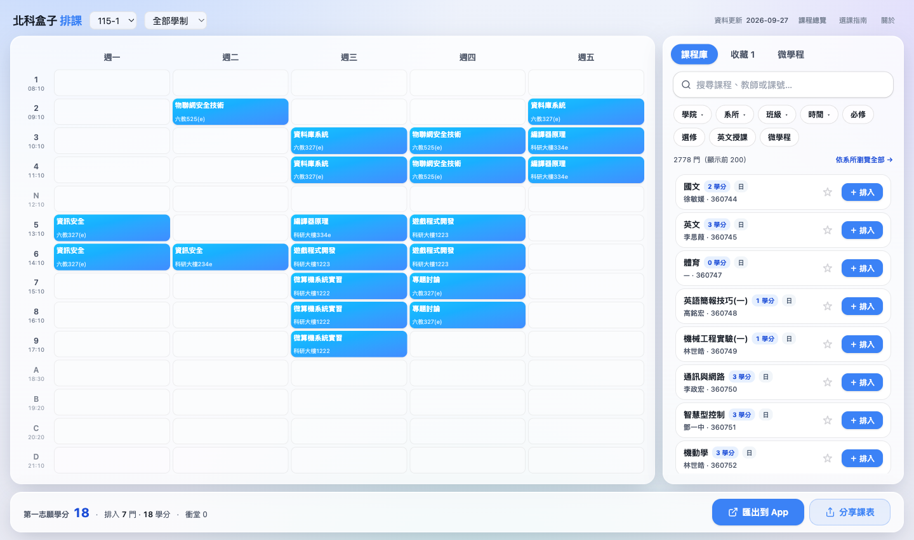
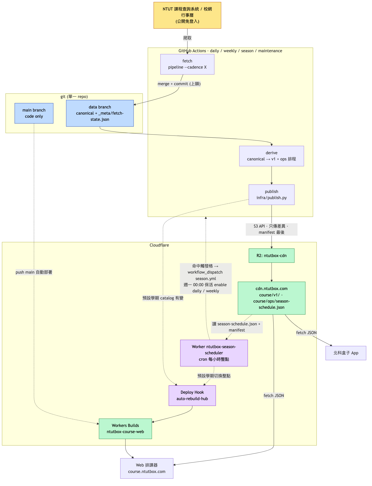

# ntutbox-course · 北科盒子 排課系統

[](https://course.ntutbox.com)
[](LICENSE)

公開、免登入的**台北科技大學排課規劃器**：在選課開放前查課、排課、即時檢查衝堂與學分，排好後一鍵把選課計畫帶進「北科盒子」iOS App，由 App 完成送件。

> **定位**：Web 端只做**規劃**——不登入、不跨域打學校系統、不代送。正式送件由北科盒子 iOS App 負責（送出前一律由使用者本人確認）；Web ↔ App 只透過「選課計畫」串接。

🔗 **立即試用 → [course.ntutbox.com](https://course.ntutbox.com)**

<p align="center"></p>

<p align="center"></p>

## 狀態

公開**初步驗證**中。資料涵蓋 110-1 起 **11 個學期、約 3.3 萬筆開課**：每日更新課程目錄與人數、每週更新課綱與教室課表；選課季（預選、開學後加退選、期中撤選）依行事曆窗口自動加密記錄人數。另有逐學期的**教室課表**（`terms/{t}/rooms.json`，含校園地圖 GIS 對應），給 App 的空教室查找用。

- ✅ **已上線**：課程爬蟲與資料管線（P0）· Web 排課器（P1 · M1）· 匯出選課計畫到 App（M3）· App 匯入確認（P2）· App 開學後加退選匯入草稿並送件
- 🚧 **進行中**：選課階段分類（M2；學制身分已完成）· App 期末預選套用草稿（[NTUTBox#247](https://github.com/poterpan/NTUTBox/issues/247)）· 送件錯誤翻譯（P3）

## 功能

**查課與排課**
- **免登入查課**：全文搜尋課名 / 教師 / 課號 / 課程編碼（前端 bigram，離線可用）
- **多維篩選**：學院 / 系所 / 班級（連動）、星期 / 節次、必選修、英語授課（EMI）、微學程；依選擇的學制調整選項
- **週課表**：週 / 日檢視；週末有課才顯示週末欄；在課程庫滑過課程時預覽它的時段
- **衝堂偵測**：同格堆疊志願序，衝堂格醒目標示
- **學分統計**：以第一志願計、排除佔位課
- **草稿與收藏**：localStorage 自動保存，逐學期獨立
- **無固定時段托盤**：沒有上課節次的課（如實務專題）獨立列出
- **預設學期自動切換**：依行事曆，本學期期中撤選截止後預設切到下學期；檢視學期不是本學期時出現「回到本學期」

**課程資訊**
- **課程詳情**：教學大綱（課程大綱 / 進度 / 評量 / 教材…）、Dcard 評價連結、相關課程
- **逐時段教室**：多教室課的每個時段各列上課教室（由教室課表反查）；課表格子顯示該節教室
- **微學程**：瀏覽分類課程清單與修讀規則原文，可直接排入課表

**分享與匯出**
- **匯出到 App**：Universal Link（`ntutbox.com/plan/…`），另提供 QR（經本站 `/open` 中繼頁）與複製連結
- **分享**：分享單堂課或整份課表（唯讀預覽，可合併或取代匯入）；分享連結有課名 OG 預覽圖

**瀏覽與指南**
- **系所總覽**（`/browse`）：各開課單位的課程清單靜態頁
- **選課指南**（`/guide`）：選課階段、制度說明等

**其他**
- **PWA**：Service Worker 快取、Apple / Liquid-Glass 風格（深色模式規劃中，[#42](https://github.com/poterpan/ntutbox-course/issues/42)）
- **匿名使用統計**：GA4，使用者同意後才啟用

> 節次採北科實際制：`1,2,3,4,N(中午),5,6,7,8,9,A,B,C,D(晚上)`；衝堂僅以「星期 × 節次」交集判定。

## 架構

<p align="center"><a href="docs/diagrams/01-architecture.png"></a></p>

> 點圖開啟原尺寸。

```
GitHub Actions（Python 爬蟲）：daily · weekly · season · maintenance
  └─ aps.ntut.edu.tw/course/tw/（公開課程查詢 · Croom 教室課表）＋ 校網行事曆 ics
     → canonical（data branch；人數以快照＋觀測紀錄保存，內容不帶爬取時間）
     → derive → v1 JSON → Cloudflare R2（cdn.ntutbox.com/course/v1/）
Cloudflare Worker（ntutbox-season-scheduler，每小時）
  └─ 依行事曆窗口觸發 season · 預設學期切換時重建網站 · 每週保活 daily／weekly
Web（Next.js · 靜態匯出 + 前端搜尋 + Service Worker · Cloudflare Workers）
  └─ course.ntutbox.com ── 選課計畫（Universal Link）→ 北科盒子 iOS App
```

> 更多圖（管線流程、資料模型、抓取邏輯、依頻率分的 workflow、選課季排程與學期切換）見 [`docs/ARCHITECTURE.md`](docs/ARCHITECTURE.md)。

## Monorepo 結構

| 路徑 | 內容 | 技術 |
|---|---|---|
| `apps/web/` | 排課 Web / PWA | Next.js 16 · TS · Tailwind · shadcn（Apple / Liquid-Glass 主題）· Cloudflare Workers |
| `crawler/` | 課程目錄 / 大綱 / 教室課表 / 行事曆爬蟲 | Python · Pydantic v2 · uv |
| `packages/schema/` | 資料合約（Pydantic → TS 型別生成） | — |
| `infra/` | 發佈（R2）· 告警 · season 排程 Worker（`infra/season-scheduler/`）· GIS 快照 | Python · wrangler |
| `docs/` | 設計 / 決策 / 架構圖 | — |

> CDN 資料合約以 `crawler/models.py`（Pydantic）為單一真相，產生 TS 型別給 Web；iOS 端以 Codable 對應。選課計畫（Web → App）的 payload 格式則以 App 端 spec 為準（見 `apps/web/src/lib/share/plan-payload.ts` 開頭註解）。

## 本機開發

### Web（`apps/web/`）

```bash
cd apps/web
pnpm install
pnpm dev          # http://localhost:3000（開發用本地 fixtures：public/data/v1）
pnpm test         # vitest
pnpm typecheck
pnpm build        # 靜態匯出到 out/
```

正式資料來自 `NEXT_PUBLIC_DATA_BASE_URL`（預設 `https://cdn.ntutbox.com/course/v1`）；未設時走本地 `public/data/v1` fixtures。

**用手機在區網實機測試**：`next.config.ts` 已設 `allowedDevOrigins`（涵蓋常用私網段與 `*.local`）。手機接同一 WiFi，開 `http://<你的-mac>.local:3000`（或 `http://<LAN-IP>:3000`）即可；用 `.local` 主機名最穩，IP 變動也免改。

### 爬蟲（`crawler/`）

```bash
cd crawler
uv venv .venv && uv pip install -p .venv/bin/python -e '.[dev]'
.venv/bin/pytest
# 抓指定資料集並合併進本地 data/canonical，再產生 v1
.venv/bin/python -m ntut_catalog pipeline --cadence manual --datasets catalog --terms 115-1 --out ../data --merge
.venv/bin/python -m ntut_catalog derive --out ../data
```

資料集登錄表、各子命令與新增資料集的方式，詳見 [`crawler/README.md`](crawler/README.md)；維運操作見 [`infra/README.md`](infra/README.md)。

## Roadmap

- **P0 — 資料 / 爬蟲**（✅）：課程目錄 / 班級 / 節次 / 大綱 / 微學程 / 課程標準 / 行事曆 / 教室課表
- **P1 — Web 排課器**（✅ M1 核心迴圈、M3 匯出；🚧 M2 選課階段分類——學制身分已完成）
- **P2 — 匯出 plan → App 匯入確認**（✅ Universal Link）
- **P3 — App 送件**（🚧 開學後加退選可匯入草稿、使用者確認後送出並逐課回報結果；期末預選以系所開課清單勾選，暫未接草稿；錯誤翻譯未做）
- **P4 — 進階**：評價（✅ Dcard 連結）· 空教室（✅ 資料；App 端實作中）· 替代課 / 畢業學分 / 行事曆 UI

## 貢獻

歡迎 issue / PR。動手前請先讀 [`CLAUDE.md`](CLAUDE.md) 與 [`docs/DESIGN.md`](docs/DESIGN.md)（資料模型、選課規則、後端實證）。慣例：

- 走 PR 進 `main`；多人 / 多代理並行時各開 git worktree + topic branch，勿共用 `main`。
- **不得提交任何個資**（學號、帳密、session、特定學生班級 / 可選課程、`.env`）。本 repo 為公開。

## 致謝

資料結構與前人經驗參考自 gnehs 開源「北科課程好朋友」（[ntut-course-crawler-node](https://github.com/gnehs/ntut-course-crawler-node) / [ntut-course-web](https://github.com/gnehs/ntut-course-web)，ISC）。本專案為**獨立重寫、非衍生 fork**。

## 免責

非台北科技大學官方系統，僅供選課規劃參考；正式選課結果以校方系統為準。

## License

[MIT](LICENSE) © 2026 PoterPan
