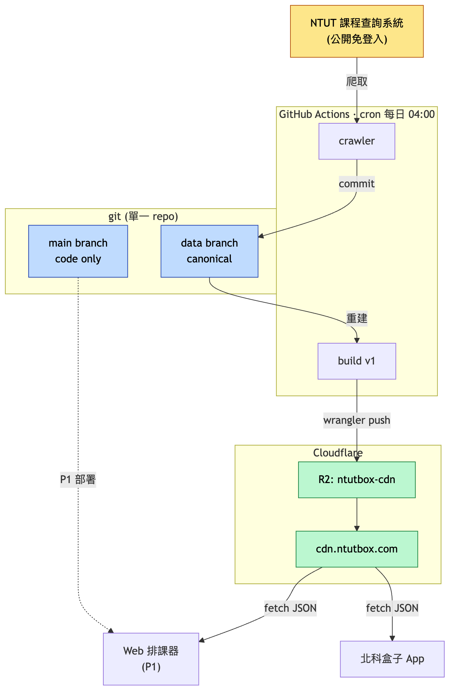
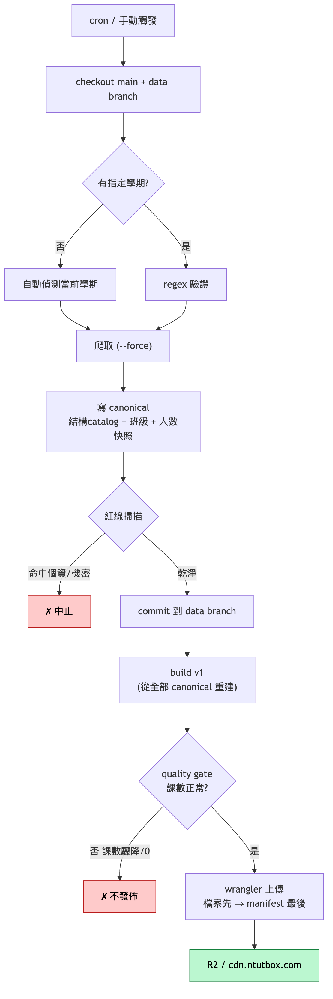
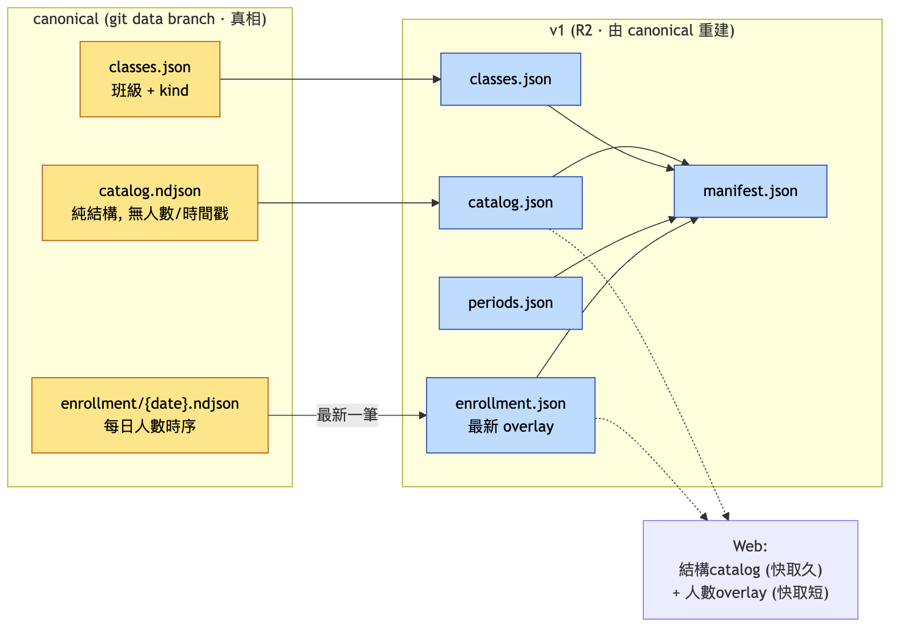
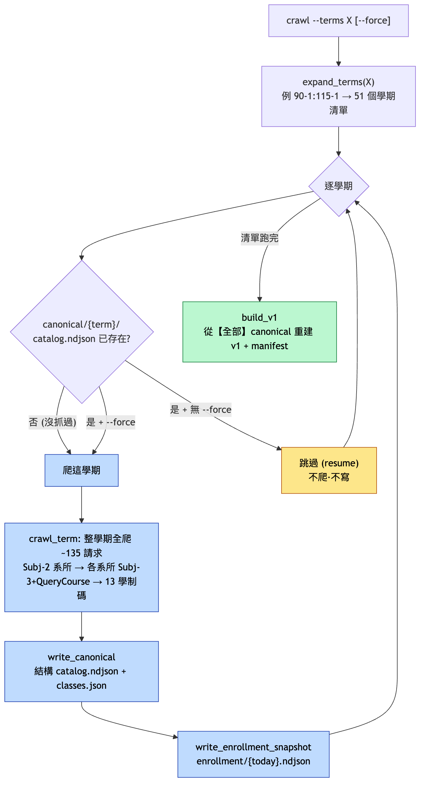
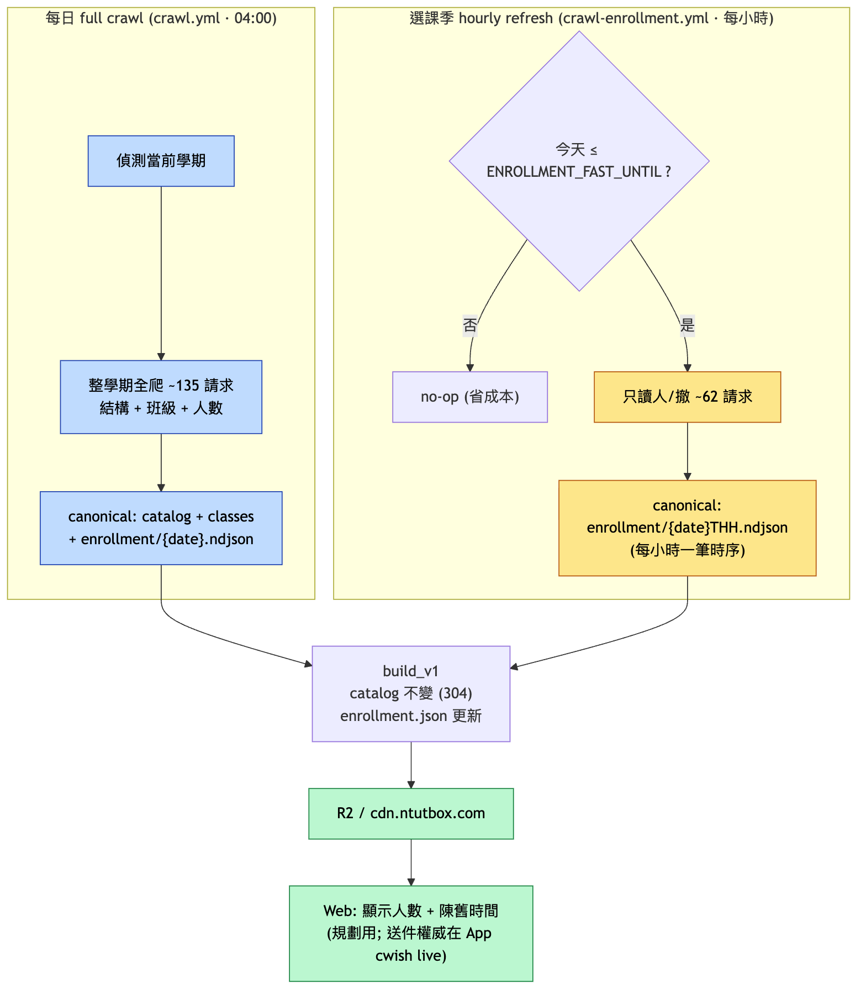

# 系統架構 / 資料管線

> 北科盒子排課系統的資料側架構（爬蟲 → canonical → R2 → 前端）。
> 圖原始碼在 `diagrams/*.mmd`、渲染圖在 `diagrams/*.png`。
> 重新渲染：`cd docs/diagrams && npx -y @mermaid-js/mermaid-cli@11 -i 01-architecture.mmd -o 01-architecture.png -b white -s 2`
> 設計依據：`DECISIONS.md`、`DESIGN.md`、`superpowers/specs/2026-06-13-infra-data-pipeline-design.md`。

## 1. 系統架構
運算在 GitHub Actions、出口在 Cloudflare R2；canonical 在 git `data` branch、main 純 code。

## 2. 每日管線流程
自動偵測當前學期 → 爬 → 寫結構化 canonical + 人數快照 → 紅線掃描 → commit data branch → 重建 v1 → quality gate → 原子發佈 R2。

## 3. 資料模型分層
catalog 純結構（快取久、結構沒變零 diff）；人數走 enrollment overlay（短快取）+ 每日時序快照。v1 完全由 canonical 重建。

## 4. 抓取邏輯（`--terms` / `--force` / skip-resume）
`--terms` 決定**抓哪些學期**（工作清單）；`--force` 決定**已抓過的要不要重抓**。逐學期判斷：canonical 已存在且無 `--force` → 跳過（resume）；否則整學期全爬。清單跑完一律重建全部 v1。

## 5. 兩種抓取節奏（每日 full vs 選課季 hourly enrollment）
平常每日 full crawl；**選課季**（`ENROLLMENT_FAST_UNTIL` 設定的窗口內）另一支 workflow 每小時輕量刷新人數（只讀人/撤 ~62 請求），寫 hourly 時序快照。兩者共用 `concurrency: data-pipeline` 序列化。catalog 不動（304），只更新 enrollment overlay。

## 設計要點
- **運算 GitHub Actions、出口 Cloudflare R2**：R2 只能被 push（無「CF 拉 git」）；Worker 跑不動爬蟲（D6）。CF git 整合留給 P1 web 部署。
- **canonical 完整可重建 v1**：CI 發佈前重建全部學期 → manifest 永遠涵蓋全學期、與 R2 物件一致。
- **catalog 純結構 + enrollment 分離**：避免每日 3MB 無意義 diff；git 歷史＝乾淨的 enrollment 時序（比 gnehs inline-people 更省）。
- **自動偵測當前學期**：學校學期末才上架下學期、開學後凍結 → 只爬偵測到的學期即足夠。
- **守門**：紅線掃描擋個資/機密進公開 repo；quality gate 擋殘缺資料發佈；原子發佈（manifest 最後推）。
- **未做（fast-follow）**：選課季 enrollment-only 高頻爬取（見 infra spec）。
