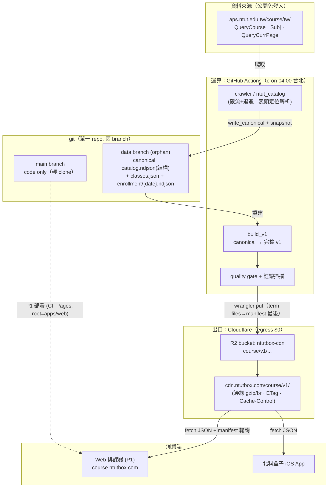
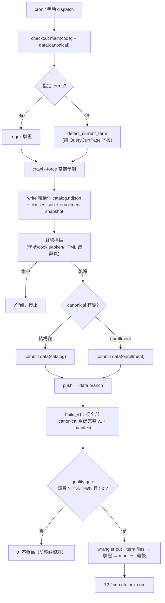
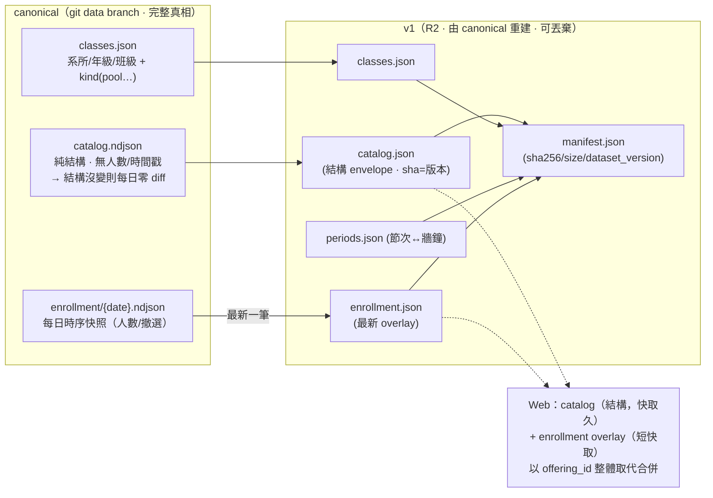

# 系統架構 / 資料管線

> 北科盒子排課系統的資料側架構（爬蟲 → canonical → R2 → 前端）。
> 設計依據：`DECISIONS.md`、`DESIGN.md`、`superpowers/specs/2026-06-13-infra-data-pipeline-design.md`。

## 1. 系統架構

## 2. 每日管線流程

## 3. 資料模型分層（為何 catalog 與 enrollment 分離）

## 設計要點對照
- **運算在 GitHub Actions、出口在 Cloudflare R2**：R2 只能被 push（無「CF 拉 git」）；Worker 跑不動爬蟲（D6）。CF git 整合留給 P1 web 部署。
- **canonical 完整可重建 v1**：CI 發佈前重建全部學期 → manifest 永遠涵蓋全學期、與 R2 物件一致。
- **catalog 純結構 + enrollment 分離**：避免每日 3MB 無意義 diff；git 歷史＝乾淨的 enrollment 時序（比 gnehs inline-people 更省）。
- **自動偵測當前學期**：學校學期末才上架下學期、開學後凍結 → 只爬偵測到的學期即足夠。
- **守門**：紅線掃描擋個資/機密進公開 repo；quality gate 擋殘缺資料發佈；原子發佈（manifest 最後推）。
- **未做（fast-follow）**：選課季 enrollment-only 高頻爬取（見 infra spec）。
