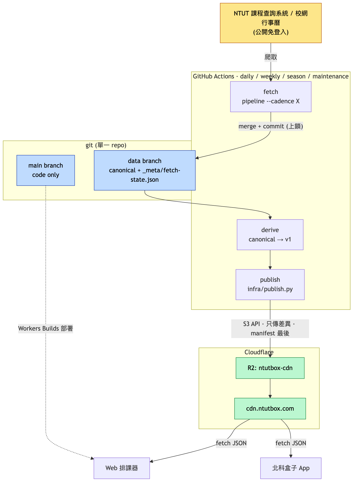
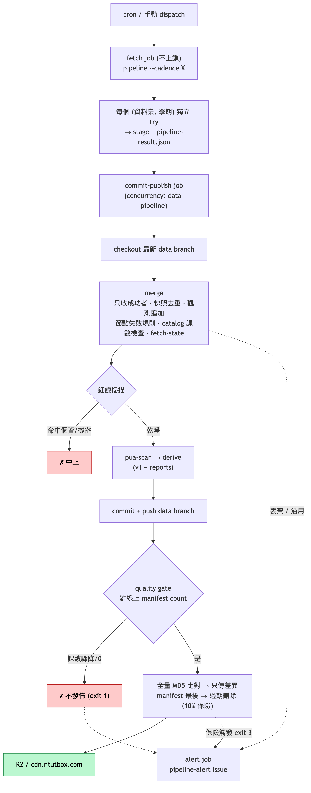
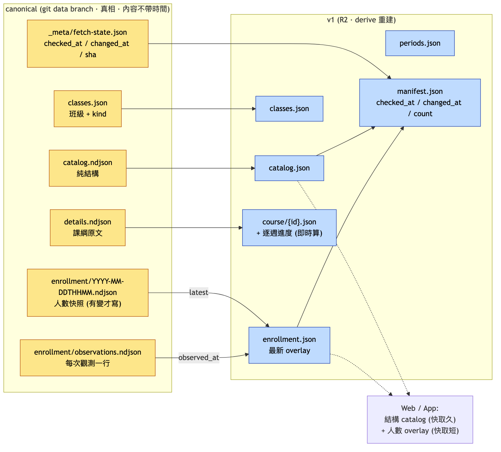
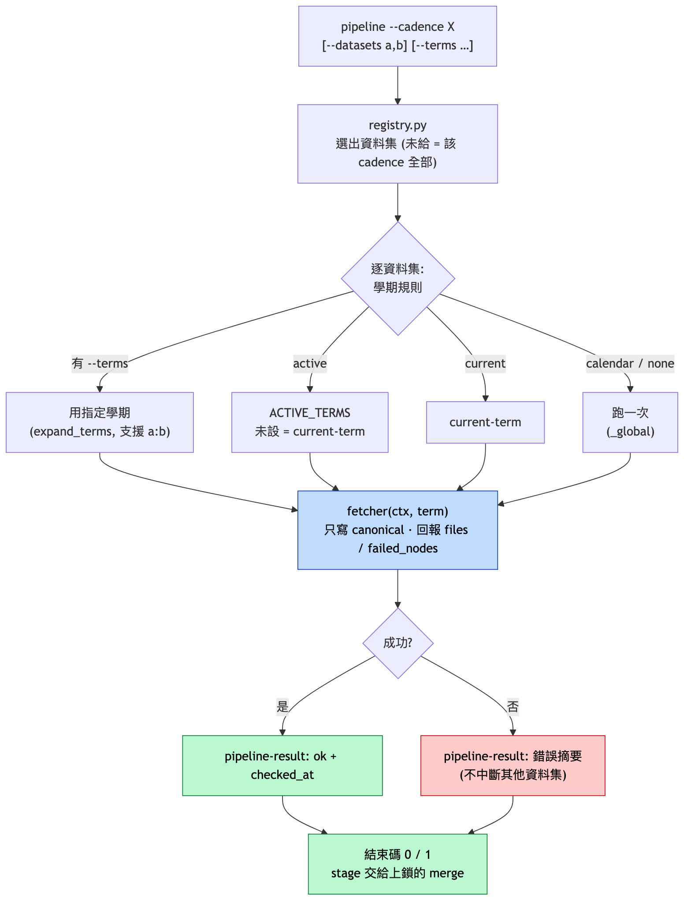
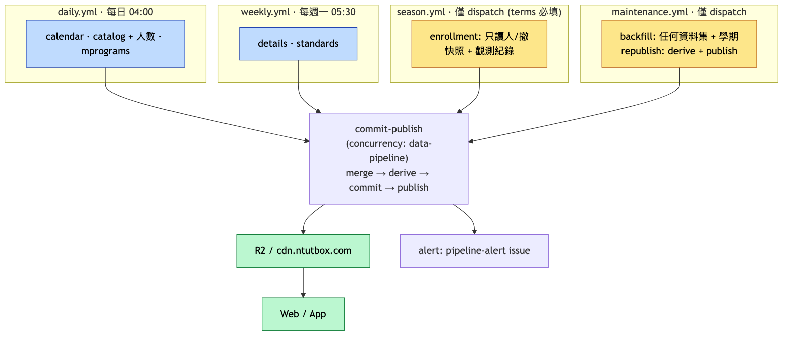

# 系統架構 / 資料管線

> 北科盒子排課系統的資料側架構（爬蟲 → canonical → R2 → 前端）。
> 圖原始碼在 `diagrams/*.mmd`、渲染圖在 `diagrams/*.png`。
> 重新渲染：`cd docs/diagrams && npx -y @mermaid-js/mermaid-cli@11 -i 01-architecture.mmd -o 01-architecture.png -b white -s 2`
> 設計依據：`DECISIONS.md`、`DESIGN.md`、`superpowers/specs/2026-09-26-data-pipeline-refactor-design.md`（管線 v2；初版為 `superpowers/specs/2026-06-13-infra-data-pipeline-design.md`）。

## 1. 系統架構
運算在 GitHub Actions、出口在 Cloudflare R2；canonical 在 git `data` branch、main 純 code。
管線分三層：**fetch**（打學校，只寫 canonical）→ **derive**（canonical → v1，確定性）→ **publish**（v1 → R2，只傳差異）。決策見 `DECISIONS.md` D11–D17。

## 2. 每支 workflow 的流程（fetch job → 上鎖的 commit-publish job）
fetch job 不上鎖、只交出檔案與 `pipeline-result.json`；commit-publish job 以 `concurrency: data-pipeline` 序列化，
對**最新** data branch 合併（去重、fetch-state、節點失敗規則、catalog 課數檢查）→ 紅線掃描 → derive → commit → publish（品質閘門、全量比對、manifest 最後推、過期刪除）。最後由 alert job 開／關 `pipeline-alert` issue。

## 3. 資料模型分層
catalog 純結構（快取久、結構沒變零 diff）；人數走快照＋觀測紀錄，v1 只出最新 overlay；「何時確認／何時變」集中在 `_meta/fetch-state.json`，canonical 內容不帶時間。v1 完全由 canonical 重建。

## 4. 資料集登錄表與學期規則
跑哪些資料集、跑哪些學期，全由 `crawler/ntut_catalog/registry.py` 決定；workflow 只傳 cadence（與選填的 `datasets`／`terms`）。
學期規則：明確給 `--terms` 優先；否則 `active` 讀 repo var `ACTIVE_TERMS`（未設＝`current-term`）、`current` 用 `current-term`、`calendar`／`none` 跑一次。每個 (資料集, 學期) 獨立 try，失敗不中斷其他。

## 5. 依頻率分的 workflow
daily（calendar、catalog＋人數、mprograms）、weekly（details、standards）、season（選課季人數，僅 dispatch、`terms` 必填）、maintenance（backfill／republish）。
全部共用 `concurrency: data-pipeline` 的 commit-publish，daily 與 season 同寫一學期的人數時，去重在鎖內做。操作手冊見 `infra/README.md`「維運 runbook」。

## 6. 憑證與 secrets 對照

**不記錄任何實際值**——這裡只寫「哪個 secret 對應哪個 Cloudflare token、給誰用、要什麼權限」，
避免日後只能靠建立時間戳反推（2026-09 就發生過）。

| GitHub secret | 來源 | 誰在用 | 備註 |
|---|---|---|---|
| `CLOUDFLARE_API_TOKEN` | R2 API Token 的 **Token value** | `wrangler r2 object put`（逐檔上傳、S3 憑證缺席時的 fallback） | |
| `R2_S3_ACCESS_KEY_ID` | 同一組 token 的 **Access Key ID** | `aws s3 cp`（批次上傳） | 三者齊備才啟用 S3 路徑 |
| `R2_S3_SECRET_ACCESS_KEY` | 同一組 token 的 **Secret Access Key** | 同上 | **只在建立時顯示一次** |
| `CLOUDFLARE_ACCOUNT_ID` | Cloudflare 帳號 ID | S3 endpoint 組裝 + wrangler | |
| `R2_BUCKET`（repo **variable**，非 secret） | bucket 名稱 | 兩條路徑 | 目前 `ntutbox-cdn` |

**關鍵認知**：R2 API Token 建立時一次給三個值，它們是**同一組憑證的兩種格式**——
Token value 給 Cloudflare 自家 API（wrangler），Access Key ID + Secret 給 S3 相容 API（aws-cli）。
不是兩組不同的東西，所以一組 token 就能同時餵飽兩條上傳路徑。

### 建立/輪替步驟
1. Cloudflare Dashboard → R2 → **Manage R2 API Tokens** → Create API Token
2. Permissions **Object Read & Write**（不需要 Admin）、限定 bucket `ntutbox-cdn`
3. 建立後畫面同時顯示 Token value / Access Key ID / Secret Access Key —— **三個都要存**
   （Secret Access Key 只顯示這一次）
4. 更新上表三個 secret（`CLOUDFLARE_ACCOUNT_ID` 不變）
5. **先跑一次 workflow 確認成功**（log 出現 `published N object(s) ... via s3`）
6. 確認穩定後才撤回舊 token；最後把新 token 改名為 `ntutbox-course-r2`

命名沿用 `ntutbox-course-r2`：這組憑證同時服務 wrangler 與 S3 兩條路徑，
名稱不要綁定其中一種（曾一度想叫 `-ci-s3`，但那會誤導成「只給 S3 用」）。

輪替時新舊並存不衝突——名稱不同即可，跑通後再撤舊的、改新的名字。

### 上傳路徑的選擇邏輯
`infra/publish.py` 在 S3 三個憑證齊備時走 `aws s3 cp --recursive`（批次、約 10 併發），
否則回退 `wrangler r2 object put`（逐檔、約 1.5 秒/檔）。`--no-s3` 可強制走 wrangler（除錯）。

兩條路徑都保留同樣的保證：**manifest 最後推**（原子性）、**per-object Cache-Control**。

> 為什麼保留 wrangler fallback：S3 那條路若出問題（aws-cli 行為變更、endpoint 異動），
> 還有一條能動的路可以比對。但 wrangler 回退**不做 listing、不比對、不刪除、沒有線上基準**，CI 不走（見 `publish.py` 檔頭）。

## 設計要點
- **運算 GitHub Actions、出口 Cloudflare R2**：R2 只能被 push（無「CF 拉 git」）；Worker 跑不動爬蟲（D6）。CF git 整合留給 P1 web 部署。
- **canonical 完整可重建 v1**：每次發佈前 derive 全部學期（確定性）→ manifest 永遠涵蓋全學期；publish 全量比對 R2、只傳差異。
- **catalog 純結構 + enrollment 分離**：避免每日 3MB 無意義 diff；git 歷史＝乾淨的 enrollment 時序（比 gnehs inline-people 更省）。
- **自動偵測當前學期**：學校學期末才上架下學期、開學後凍結 → 平常只爬偵測到的學期；選課季要同時追兩學期時設 `ACTIVE_TERMS`。
- **守門**：紅線掃描擋個資/機密進公開 repo；merge 擋殘缺上游（節點失敗、課數驟降）覆寫 canonical；quality gate 擋殘缺資料發佈；原子發佈（manifest 最後推）；過期刪除有 10% 保險；失敗與資料過期自動開 issue。
- **未做**：season 的自動觸發（Cloudflare Cron＋選課窗口從行事曆解析），目前只能手動 dispatch。
