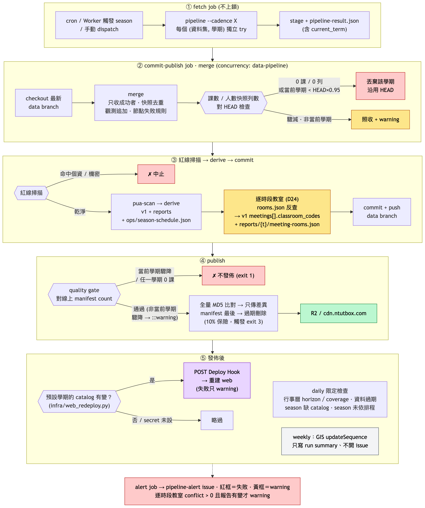
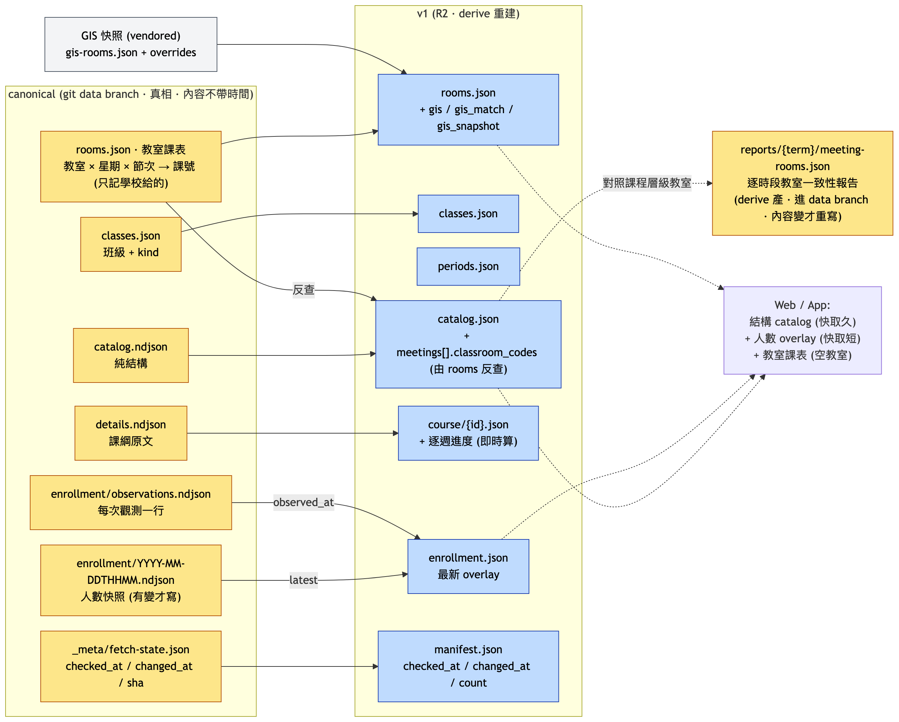
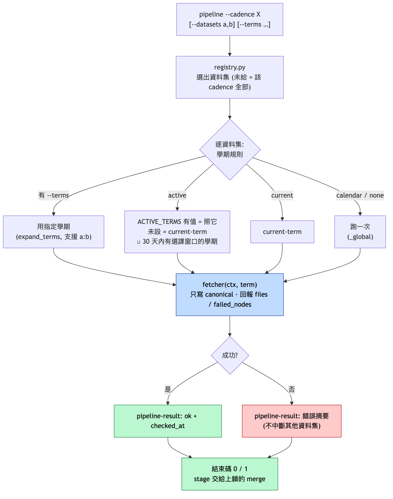
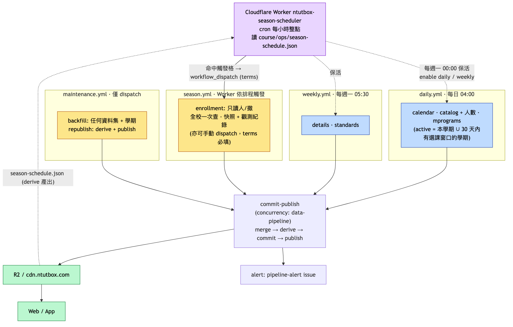
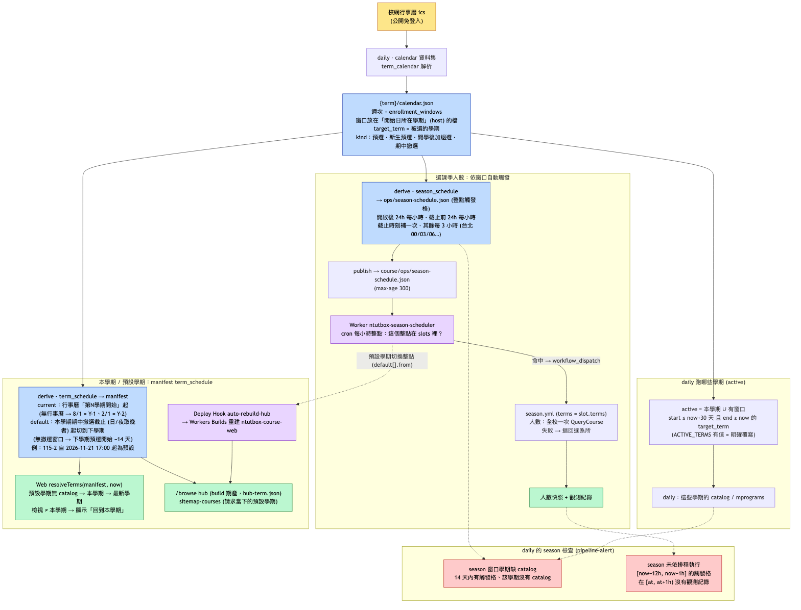

# 系統架構 / 資料管線

> 北科盒子排課系統的資料側架構（爬蟲 → canonical → R2 → 前端）。
> 圖原始碼在 `diagrams/*.mmd`、渲染圖在 `diagrams/*.png`。
> 重新渲染：`cd docs/diagrams && npx -y @mermaid-js/mermaid-cli@11 -i 01-architecture.mmd -o 01-architecture.png -b white -s 2`
> 設計依據：`DECISIONS.md`、`DESIGN.md`、`superpowers/specs/2026-09-26-data-pipeline-refactor-design.md`（管線 v2；初版為 `superpowers/specs/2026-06-13-infra-data-pipeline-design.md`）。

## 1. 系統架構
運算在 GitHub Actions、出口在 Cloudflare R2；canonical 在 git `data` branch、main 純 code。
管線分三層：**fetch**（打學校，只寫 canonical）→ **derive**（canonical → v1 與 `ops/season-schedule.json`，確定性）→ **publish**（→ R2，只傳差異）。決策見 `DECISIONS.md` D11–D22。

觸發端除了 GitHub cron，還有一支 cron-only 的 Cloudflare Worker **`ntutbox-season-scheduler`**（`infra/season-scheduler/`；無 route、無 Custom Domain）：
每小時整點讀 `course/ops/season-schedule.json` 與 manifest——命中觸發格就 `workflow_dispatch` season.yml（D18）；
台北週一 00:00 `enable` daily／weekly，避免 60 天沒活動被 GitHub 停用（D19）；到了預設學期切換的整點就 POST Deploy Hook（D22）。
web 的 Workers Builds（`ntutbox-course-web`）因此有三種觸發：push main、管線發佈後「預設學期的 catalog 有變」、Worker 的學期切換整點。

## 2. 每支 workflow 的流程（fetch job → 上鎖的 commit-publish job）
fetch job 不上鎖、只交出檔案與 `pipeline-result.json`；commit-publish job 以 `concurrency: data-pipeline` 序列化，
對**最新** data branch 合併（去重、fetch-state、節點失敗規則、catalog 課數／人數快照檢查）→ 紅線掃描 → derive → commit → publish（品質閘門、全量比對、manifest 最後推、過期刪除）→ 視需要觸發 web 重新部署。最後由 alert job 開／關 `pipeline-alert` issue。

- **驟減檢查只對當前學期嚴格**（D20）：`current_term` 由 fetch 記進 `pipeline-result.json`。任何學期 0 課／0 列一律丟棄；
  當前學期「< HEAD × 0.95」丟棄、沿用 HEAD；其他學期（例如即將選課、先放草案課表的學期）照收＋warning。人數快照同規則。
  publish 閘門同理：當前學期驟減擋下，其他學期只擋 0 課、驟減印 `::warning`。取不到當前學期 → 全部學期嚴格（原行為）。
- **web 重新部署**（D22）：publish 成功後，若預設學期（`term_schedule.default`，沒有 catalog 就退回本學期→最新學期，與 web 同語意）的 catalog 有變，
  POST `WEB_DEPLOY_HOOK_URL`（決策在 `infra/web_redeploy.py`）。secret 未設 → 略過；失敗只 warning、不擋資料 job。
- **daily 限定檢查**：行事曆 horizon／coverage、資料過期，以及兩個 season 檢查（見第 6 節）。

## 3. 資料模型分層
catalog 純結構（快取久、結構沒變零 diff）；人數走快照＋觀測紀錄，v1 只出最新 overlay；「何時確認／何時變」集中在 `_meta/fetch-state.json`，canonical 內容不帶時間。v1 完全由 canonical 重建。

## 4. 資料集登錄表與學期規則
跑哪些資料集、跑哪些學期，全由 `crawler/ntut_catalog/registry.py` 決定；workflow 只傳 cadence（與選填的 `datasets`／`terms`）。
學期規則：明確給 `--terms` 優先；否則 `active`＝`current-term` ∪ 30 天內有選課窗口的學期（D19；repo var `ACTIVE_TERMS` 有設則為明確覆寫）、`current` 用 `current-term`、`calendar`／`none` 跑一次。每個 (資料集, 學期) 獨立 try，失敗不中斷其他。

## 5. 依頻率分的 workflow
daily（calendar、catalog＋人數、mprograms）、weekly（details、standards）、season（選課季人數，由 Worker 依排程 dispatch，也可手動；`terms` 必填）、maintenance（backfill／republish）。
Worker 每週一保活 daily／weekly（`PUT …/enable`，冪等）。全部共用 `concurrency: data-pipeline` 的 commit-publish，daily 與 season 同寫一學期的人數時，去重在鎖內做。操作手冊見 `infra/README.md`「維運 runbook」。

## 6. 選課季排程與學期切換
一切從行事曆出發：daily 的 calendar 資料集把校網 ics 解析成 `{term}/calendar.json`（週次＋`enrollment_windows`）。
窗口寫進**開始日所在學期**（host）的檔，`target_term` 記被選的學期——例如 116-1 預選（2027-05）放在 115-2 的檔、target 116-1。
kind：預選（校方稱「網路選課」）、新生預選、開學後加退選（校方稱「加選及無紀錄退選」）、期中撤選；沒寫時刻 → 日間 17:00／進修 21:00。

- **season 排程**（D18）：derive 把窗口展開成整點觸發格 `ops/season-schedule.json`——開啟後 24 小時每小時、截止前 24 小時每小時、
  截止時刻補一次、其餘每 3 小時（台北 00／03／06…）；同一整點合併。Worker 命中觸發格就以 `terms` dispatch season.yml；
  season 的人數先全校一次 `QueryCourse`，失敗（逾時、無表頭、0 課）才退回逐系所。
- **daily 跑哪些學期**（D19）：`active`＝本學期 ∪ 有窗口 `start ≤ now+30 天` 且 `end ≥ now` 的 `target_term`；`ACTIVE_TERMS` 有值則完全照它。
- **本學期／預設學期**（D21）：derive 在 manifest 產 `term_schedule`（`current`、`default` 兩條 `{term, from}` 時間軸，取 `from ≤ now` 最後一筆）。
  本學期＝8/1～1/31 上學期、2/1～7/31 下學期；預設學期從本學期**期中撤選截止**（日／夜取晚者）起改為下學期（推不出撤選窗口 → 下學期預選開始 −14 天）。
  例：115-2 自 2026-11-21 17:00 起為預設。web 的 `resolveTerms(manifest, now)`（`apps/web/src/lib/terms/term-schedule.ts`）決定預設選取，
  預設學期還沒 catalog → 本學期 → 最新學期；檢視學期 ≠ 本學期時顯示「回到本學期」。`/sitemap-courses.xml` 依請求當下的預設學期產；
  `/browse/**` hub 在 build 期產（連結讀 `/hub-term.json`），所以 Worker 在每筆 `default[].from` 的整點觸發 Deploy Hook 重建。
- **daily 的 season 檢查**：「season 窗口學期缺 catalog」（14 天內有觸發格、該學期沒有 `catalog.ndjson`）；
  「season 未依排程執行」（`at` 在 [now−12h, now−1h] 的觸發格，在 [at, at+1h) 找不到觀測紀錄）。兩者都會開 issue、對上後自動關閉。

## 7. 憑證與 secrets 對照

**不記錄任何實際值**——這裡只寫「哪個 secret 對應哪個 Cloudflare token、給誰用、要什麼權限」，
避免日後只能靠建立時間戳反推（2026-09 就發生過）。

| GitHub secret | 來源 | 誰在用 | 備註 |
|---|---|---|---|
| `CLOUDFLARE_API_TOKEN` | R2 API Token 的 **Token value** | `wrangler r2 object put`（逐檔上傳、S3 憑證缺席時的 fallback） | |
| `R2_S3_ACCESS_KEY_ID` | 同一組 token 的 **Access Key ID** | `aws s3 cp`（批次上傳） | 三者齊備才啟用 S3 路徑 |
| `R2_S3_SECRET_ACCESS_KEY` | 同一組 token 的 **Secret Access Key** | 同上 | **只在建立時顯示一次** |
| `CLOUDFLARE_ACCOUNT_ID` | Cloudflare 帳號 ID | S3 endpoint 組裝 + wrangler | |
| `R2_BUCKET`（repo **variable**，非 secret） | bucket 名稱 | 兩條路徑 | 目前 `ntutbox-cdn` |
| `WEB_DEPLOY_HOOK_URL` | `ntutbox-course-web` 的 Workers Builds **Deploy Hook** URL | commit-publish 的 web 重新部署步驟（D22） | 未設 → 略過；各 workflow 以 input 傳給 composite action |

Worker `ntutbox-season-scheduler` 的 secret（`npx wrangler secret put`，不在 GitHub）：

| Worker secret | 來源 | 用途 | 備註 |
|---|---|---|---|
| `GITHUB_TOKEN` | fine-grained PAT，只限本 repo，**Actions: Read and write** | dispatch season.yml、保活 enable daily／weekly | PAT 有到期日，到期前要換 |
| `DEPLOY_HOOK_URL` | 同一個 Deploy Hook URL | 預設學期切換整點重建 web | 選填；未設 → 跳過 |

**關鍵認知**：R2 API Token 建立時一次給三個值，它們是**同一組憑證的兩種格式**——
Token value 給 Cloudflare 自家 API（wrangler），Access Key ID + Secret 給 S3 相容 API（aws-cli）。
不是兩組不同的東西，所以一組 token 就能同時餵飽兩條上傳路徑。

### 建立/輪替步驟
1. Cloudflare Dashboard → R2 → **Manage R2 API Tokens** → Create API Token
2. Permissions **Object Read & Write**（不需要 Admin）、限定 bucket `ntutbox-cdn`
3. 建立後畫面同時顯示 Token value / Access Key ID / Secret Access Key —— **三個都要存**
   （Secret Access Key 只顯示這一次）
4. 更新上表三個 secret（`CLOUDFLARE_ACCOUNT_ID` 不變）
5. **先跑一次 workflow 確認成功**（log 出現 `published N object(s) ... via s3`）
6. 確認穩定後才撤回舊 token；最後把新 token 改名為 `ntutbox-course-r2`

命名沿用 `ntutbox-course-r2`：這組憑證同時服務 wrangler 與 S3 兩條路徑，
名稱不要綁定其中一種（曾一度想叫 `-ci-s3`，但那會誤導成「只給 S3 用」）。

輪替時新舊並存不衝突——名稱不同即可，跑通後再撤舊的、改新的名字。

### 上傳路徑的選擇邏輯
`infra/publish.py` 在 S3 三個憑證齊備時走 `aws s3 cp --recursive`（批次、約 10 併發），
否則回退 `wrangler r2 object put`（逐檔、約 1.5 秒/檔）。`--no-s3` 可強制走 wrangler（除錯）。

兩條路徑都保留同樣的保證：**manifest 最後推**（原子性）、**per-object Cache-Control**。

> 為什麼保留 wrangler fallback：S3 那條路若出問題（aws-cli 行為變更、endpoint 異動），
> 還有一條能動的路可以比對。但 wrangler 回退**不做 listing、不比對、不刪除、沒有線上基準**，CI 不走（見 `publish.py` 檔頭）。

## 設計要點
- **運算 GitHub Actions、出口 Cloudflare R2**：R2 只能被 push（無「CF 拉 git」）；Worker 跑不動爬蟲（D6）。CF git 整合留給 P1 web 部署。
- **canonical 完整可重建 v1**：每次發佈前 derive 全部學期（確定性）→ manifest 永遠涵蓋全學期；publish 全量比對 R2、只傳差異。
- **catalog 純結構 + enrollment 分離**：避免每日 3MB 無意義 diff；git 歷史＝乾淨的 enrollment 時序（比 gnehs inline-people 更省）。
- **自動偵測當前學期**：學校學期末才上架下學期、開學後凍結 → 平常只爬偵測到的學期；選課窗口 30 天前自動把被選的學期一起納入（D19），不必手動設 `ACTIVE_TERMS`。
- **守門**：紅線掃描擋個資/機密進公開 repo；merge 擋殘缺上游（節點失敗、課數驟降）覆寫 canonical；quality gate 擋殘缺資料發佈；原子發佈（manifest 最後推）；過期刪除有 10% 保險；失敗與資料過期自動開 issue。
- **season 自動觸發**：Cloudflare Worker `ntutbox-season-scheduler` 每小時讀 `course/ops/season-schedule.json` 觸發 season（D18），每週一並 enable daily／weekly 防 60 天自動停用（D19）；排程邏輯全在 Python，Worker 只比對整點。
- **預設學期依日期切換、web 自動重建**：manifest `term_schedule` 決定本學期／預設學期（D21）；預設學期的 catalog 有變或切換整點到了，就觸發 Deploy Hook 重建 hub（D22）。
