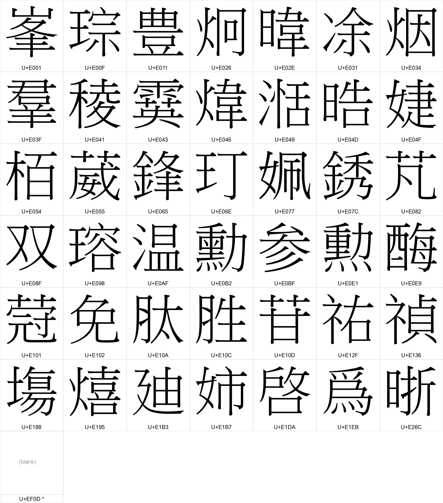

# PUA 造字字形考證（GServer 外字採收，2026-07-20）

> 逆向學校華康 GServer 外字服務，從學校自有造字檔 `MingGaiji.TTE` 撈出全部 **43 個**
> PUA 造字碼位的字形並認字。**6 個既有對照（#44／#45 系網考證）與 GServer 字形完全吻合＝權威反證**。
> 本文為 `crawler/ntut_catalog/pua.py` 的 `PUA_MAP` 造字段依據。

## 1. 摘要

- **問題**：學校課程資料的教師名／課名／備註／課綱含私用區（PUA，主要 U+E0xx–U+E2xx）造字，一般瀏覽器無對應字型可畫（顯示為缺字方塊 ◻）。#44 建立分層正規化（canonical 忠實、v1 best-effort），#45 先補 5 個系網考證字。

- **字形來源＝權威**：學校自己的華康 GServer 外字服務（`font.ntut.edu.tw`）供應的 `MingGaiji.TTE`（學校造字檔）。直接取學校用來畫這些字的原始字型輪廓來認字，不再靠上下文猜測，並與既有系網考證交叉反證。

- **結果統計（43 碼位）**：
  - **42 碼位已認字**（含 6 個既有對照；其中 `E031`／`E10D`／`E0E1` 由使用者覆核修正／補上，見 §4.1、§5）；
  - **1 碼位無字形**：`U+EF0D`（cmap 有碼位但 glyf 無輪廓，非實際造字，見 §4.2）。

- **入庫**：`PUA_MAP` 造字段現共 **42 碼位**；其中 `E031`／`E10D`／`E0E1` 三筆由使用者考證修正／補上（見 §4.1、§5）。`EF0D`（無字形、證據未定）不入表，維持「未收錄一律原樣保留（不猜、不刪）」原則。



## 2. GServer 外字服務協定（供未來新造字半自動考證）

學校用「華康 GServer 動態外字」在網頁畫這些造字。流程可程式化重現（**唯讀、務必節流 ≥0.6s/req、帶 Referer**）：

1. **域名**：`https://font.ntut.edu.tw/gws`。
2. **查詢（socket）**：GET 一個 socket 端點，字元以 UTF-8 百分比編碼帶在 `wd`（前導一個空格 `%20`，故產出的字型檔恰含「拉丁基本 + 這一個 PUA 字」）：

   ```
   /gws/socket/wfc_socket.aspx?queryType=query&tf=MingGaiji.TTE
     &wd=%20<URL編碼字>&fn=<rand>_ff.png&ff=MingLiu
     &pnglocation=/gws/outline/wfc/<rand>_ff.png
     &isUTF8=true&theProtocol=https&useBrowser=tt&PEncode=UTF-8
   ```

   `fn`（檔名）**由 client 隨機自選**（`<1..735723>_ff.png`）；socket 呼叫是「副作用」——伺服器據此在 `pnglocation` 生成該字型檔。回應是一段 JS（`parent.cssPath='https://.../fontcss/<fn>.css';…`），指向動態產生的 CSS。
3. **取字型檔**：GET `/gws/outline/wfc/<fn>`。**副檔名雖是 `.png`，內容其實是 TTF**（magic `00 01 00 00`，Content-Type 謊報 `image/png`）——瀏覽器 `@font-face` 靠內容 sniff 吃它，直接當圖片開會被圖片解碼器拒絕。
4. **認字**：`fontTools` 讀 cmap 確認碼位有 glyph、`glyf` 輪廓非空；`freetype` 算圖比對真字（本次 256px 算圖、置中貼 300×300、反白為黑字白底）。

**禮貌使用**：唯讀查學校自有字型；本次採收每 request 間隔 0.6s、單一 UA＋Referer，一次把 43 碼位撈完即止。工具腳本見素材 `gserver-glyphs/harvest.py`。

## 3. 認字結果總表（43 碼位）

認定字的 `U+` 一律以 Python `ord()` 計算（避免手抄異體字錯碼，如 峯 U+5CEF≠峰 U+5CF0、羣≠群、塲≠場、姉≠姊、啓≠啟、爲≠為）。出處 URL 可直接點開學校課程系統核對。雙造字姓名（溫紹羣、吳姉霙）的 ◻ 無法自動辨位，依字形位置手動覆核。

| 碼位 | 認定字 (U+) | 信心 | 出處樣本（學校頁可點） | 狀態 |
|---|---|---|---|---|
| `U+E001` | 峯 (U+5CEF) | high | 教師 [楊明峯](https://aps.ntut.edu.tw/course/tw/Teach.jsp?format=-3&year=115&sem=1&code=21963)（115-1）；課綱課號 [362760](https://aps.ntut.edu.tw/course/tw/ShowSyllabus.jsp?snum=362760&code=12302)：…化學，曾文峯、許君漢、曹文正編… | 本 PR 新增 PUA_MAP |
| `U+E00F` | 琮 (U+742E) | high | 教師 [黃琮昇](https://aps.ntut.edu.tw/course/tw/Teach.jsp?format=-3&year=115&sem=1&code=12338)（115-1）；課綱課號 [362229](https://aps.ntut.edu.tw/course/tw/ShowSyllabus.jsp?snum=362229&code=12338)：…黃琮昇… | 已入 PUA_MAP（#44/#45） |
| `U+E011` | 豐 (U+8C50) | high | 課綱課號 [366889](https://aps.ntut.edu.tw/course/tw/ShowSyllabus.jsp?snum=366889&code=22314)：…亞洲現代美術館、日本豐島美術館… | 本 PR 新增 PUA_MAP |
| `U+E026` | 炯 (U+70AF) | high | 教師 [陳炯曉](https://aps.ntut.edu.tw/course/tw/Teach.jsp?format=-3&year=114&sem=2&code=22027)（114-2） | 本 PR 新增 PUA_MAP |
| `U+E02E` | 暐 (U+6690) | high | 課綱課號 [366510](https://aps.ntut.edu.tw/course/tw/ShowSyllabus.jsp?snum=366510&code=11172)：…功能介紹 譯者： 蘇暐婷 出版社：旗標…；課綱課號 [366517](https://aps.ntut.edu.tw/course/tw/ShowSyllabus.jsp?snum=366517&code=11172)：…功能介紹 譯者： 蘇暐婷 出版社：旗標… | 本 PR 新增 PUA_MAP |
| `U+E031` | 凃 (U+51C3) | 使用者考證 | 課綱課號 [366510](https://aps.ntut.edu.tw/course/tw/ShowSyllabus.jsp?snum=366510&code=11172)：…作者： 凃俐雯 追蹤作者…（教材作者；字形左旁為冫兩點水，非氵；採收誤認為涂） | 本 PR 新增 PUA_MAP |
| `U+E034` | 烟 (U+70DF) | high | 課綱課號 [366571](https://aps.ntut.edu.tw/course/tw/ShowSyllabus.jsp?snum=366571&code=24544)：…/ 傳） 2. 《雲烟過眼錄》（宋 周密… | 本 PR 新增 PUA_MAP |
| `U+E03F` | 羣 (U+7FA3) | high | 教師 [溫紹羣](https://aps.ntut.edu.tw/course/tw/Teach.jsp?format=-3&year=115&sem=1&code=24600)（115-1）；備註課號 [338762](https://aps.ntut.edu.tw/course/tw/Curr.jsp?format=-2&code=338762)：…理，台北上課( 溫紹羣)… | 本 PR 新增 PUA_MAP |
| `U+E041` | 稜 (U+7A1C) | high | 課綱課號 [362994](https://aps.ntut.edu.tw/course/tw/ShowSyllabus.jsp?snum=362994&code=12350)：…重閱讀，猶如光線照進稜鏡——閱讀〈物哀〉…；課綱課號 [363135](https://aps.ntut.edu.tw/course/tw/ShowSyllabus.jsp?snum=363135&code=12350)：…重閱讀，猶如光線照進稜鏡——閱讀〈物哀〉… | 本 PR 新增 PUA_MAP |
| `U+E043` | 霙 (U+9719) | high | 教師 [吳姉霙](https://aps.ntut.edu.tw/course/tw/Teach.jsp?format=-3&year=115&sem=1&code=24191)（115-1） | 本 PR 新增 PUA_MAP |
| `U+E046` | 煒 (U+7152) | high | 教師 [徐昕煒](https://aps.ntut.edu.tw/course/tw/Teach.jsp?format=-3&year=115&sem=1&code=12436)（115-1）；教師 [林明煒](https://aps.ntut.edu.tw/course/tw/Teach.jsp?format=-3&year=115&sem=1&code=24556)（115-1） | 已入 PUA_MAP（#44/#45） |
| `U+E049` | 湉 (U+6E49) | high | 課綱課號 [366781](https://aps.ntut.edu.tw/course/tw/ShowSyllabus.jsp?snum=366781&code=23670)：…Co.（著）、謝永湉（譯），《一九五八…；課綱課號 [366844](https://aps.ntut.edu.tw/course/tw/ShowSyllabus.jsp?snum=366844&code=23670)：…Co.（著）、謝永湉（譯），《一九五八… | 本 PR 新增 PUA_MAP |
| `U+E04D` | 晧 (U+6667) | high | 教師 [林晢晧](https://aps.ntut.edu.tw/course/tw/Teach.jsp?format=-3&year=112&sem=2&code=24507)（112-2） | 本 PR 新增 PUA_MAP |
| `U+E04F` | 婕 (U+5A55) | high | 課綱課號 [366876](https://aps.ntut.edu.tw/course/tw/ShowSyllabus.jsp?snum=366876&code=22640)：…劉昉青 祁業榮 郭婕 (2007)。運… | 本 PR 新增 PUA_MAP |
| `U+E054` | 栢 (U+6822) | high | 備註課號 [325372](https://aps.ntut.edu.tw/course/tw/Curr.jsp?format=-2&code=325372)：…教師李栢浡,CLS410教…；備註課號 [318094](https://aps.ntut.edu.tw/course/tw/Curr.jsp?format=-2&code=318094)：…教師李栢浡,CLS410教… | 本 PR 新增 PUA_MAP |
| `U+E055` | 葳 (U+8473) | high | 課綱課號 [361268](https://aps.ntut.edu.tw/course/tw/ShowSyllabus.jsp?snum=361268&code=12200)：…，有任何問題可與吳南葳老師(nwwu@n…；課綱課號 [362492](https://aps.ntut.edu.tw/course/tw/ShowSyllabus.jsp?snum=362492&code=12200)：…，有任何問題可與吳南葳老師(nwwu@n… | 本 PR 新增 PUA_MAP |
| `U+E065` | 鋒 (U+92D2) | high | 課綱課號 [361491](https://aps.ntut.edu.tw/course/tw/ShowSyllabus.jsp?snum=361491&code=12036)：…之超快雷射鑽孔 曾釋鋒 教授 第2週 P…；課綱課號 [362821](https://aps.ntut.edu.tw/course/tw/ShowSyllabus.jsp?snum=362821&code=11493)：…計（第二版）, 劉邦鋒 著, 國立臺灣大… | 本 PR 新增 PUA_MAP |
| `U+E06E` | 玎 (U+738E) | high | 課綱課號 [364509](https://aps.ntut.edu.tw/course/tw/ShowSyllabus.jsp?snum=364509&code=12037)：…裕, 張宇欣, 廖凰玎，2015 ，臺灣… | 本 PR 新增 PUA_MAP |
| `U+E077` | 姵 (U+59F5) | high | 備註課號 [325274](https://aps.ntut.edu.tw/course/tw/Curr.jsp?format=-2&code=325274)：…教師黃文曄、丁姵如,法2F03教室…；備註課號 [325284](https://aps.ntut.edu.tw/course/tw/Curr.jsp?format=-2&code=325284)：…教師丁姵如,商5F01教室… | 本 PR 新增 PUA_MAP |
| `U+E07C` | 銹 (U+92B9) | high | 課綱課號 [361713](https://aps.ntut.edu.tw/course/tw/ShowSyllabus.jsp?snum=361713&code=10506)：…質變化實驗。 2.不銹鋼料（18-8不銹…；課綱課號 [364411](https://aps.ntut.edu.tw/course/tw/ShowSyllabus.jsp?snum=364411&code=11364)：…第七週 構造用鋼及不銹鋼之種類、特性及選… | 本 PR 新增 PUA_MAP |
| `U+E082` | 芃 (U+8283) | high | 備註課號 [325285](https://aps.ntut.edu.tw/course/tw/Curr.jsp?format=-2&code=325285)：…教師蘇芃竹,社205教室,…；備註課號 [325288](https://aps.ntut.edu.tw/course/tw/Curr.jsp?format=-2&code=325288)：…教師蘇芃竹,社205教室,… | 本 PR 新增 PUA_MAP |
| `U+E08F` | 双 (U+53CC) | high | 課綱課號 [366823](https://aps.ntut.edu.tw/course/tw/ShowSyllabus.jsp?snum=366823&code=24411)：…000）。 2. 楊双子，《綺譚花物語》… | 本 PR 新增 PUA_MAP |
| `U+E098` | 瑢 (U+7462) | high | 課綱課號 [366810](https://aps.ntut.edu.tw/course/tw/ShowSyllabus.jsp?snum=366810&code=12379)：…r 譯者： 余芊瑢, 朱惠瓊 出版社…；課綱課號 [366910](https://aps.ntut.edu.tw/course/tw/ShowSyllabus.jsp?snum=366910&code=12379)：…r 譯者： 余芊瑢, 朱惠瓊 出版社… | 本 PR 新增 PUA_MAP |
| `U+E0AF` | 溫 (U+6EAB) | high | 教師 [溫紹羣](https://aps.ntut.edu.tw/course/tw/Teach.jsp?format=-3&year=115&sem=1&code=24600)（115-1）；備註課號 [353176](https://aps.ntut.edu.tw/course/tw/Curr.jsp?format=-2&code=353176)：…陽明交大溫宏斌https:/… | 本 PR 新增 PUA_MAP |
| `U+E0B2` | 勳 (U+52F3) | high | 教師 [吳建勳](https://aps.ntut.edu.tw/course/tw/Teach.jsp?format=-3&year=115&sem=1&code=12285)（115-1）；教師 [陳佳勳](https://aps.ntut.edu.tw/course/tw/Teach.jsp?format=-3&year=115&sem=1&code=12630)（115-1） | 已入 PUA_MAP（#44/#45） |
| `U+E0BF` | 參 (U+53C3) | high | 課綱課號 [362429](https://aps.ntut.edu.tw/course/tw/ShowSyllabus.jsp?snum=362429&code=23467)：…討論、上課狀況、上課參與、作業等):40…；課綱課號 [366271](https://aps.ntut.edu.tw/course/tw/ShowSyllabus.jsp?snum=366271&code=11014)：…：日本紀伊山地?場?參詣道、絲綢之路… | 本 PR 新增 PUA_MAP |
| `U+E0E1` | 勳 (U+52F3) | 使用者考證 | 教師 [王柏勳](https://aps.ntut.edu.tw/course/tw/Teach.jsp?format=-3&year=113&sem=1&code=24593)（113-1；經教師本人社群帳號確認） | 本 PR 新增 PUA_MAP（與 E0B2 同字異碼） |
| `U+E0E9` | 酶 (U+9176) | high | 課綱課號 [362852](https://aps.ntut.edu.tw/course/tw/ShowSyllabus.jsp?snum=362852&code=12678)：…序列稀釋，DNA複製酶連鎖反應，質體分離…；課程說明課號 [362852](https://aps.ntut.edu.tw/course/tw/Curr.jsp?format=-2&code=362852)：…序列稀釋，DNA複製酶連鎖反應，質體分離… | 本 PR 新增 PUA_MAP |
| `U+E101` | 蔻 (U+853B) | high | 教師 [賴峓蔻](https://aps.ntut.edu.tw/course/tw/Teach.jsp?format=-3&year=115&sem=1&code=24232)（115-1）；課綱課號 [366483](https://aps.ntut.edu.tw/course/tw/ShowSyllabus.jsp?snum=366483&code=24232)：…賴峓蔻… | 本 PR 新增 PUA_MAP |
| `U+E102` | 免 (U+514D) | high | 課綱課號 [360924](https://aps.ntut.edu.tw/course/tw/ShowSyllabus.jsp?snum=360924&code=22898)：…勃發展，為癌症、自體免疫疾病等難治疾病的…；課綱課號 [360955](https://aps.ntut.edu.tw/course/tw/ShowSyllabus.jsp?snum=360955&code=10894)：…活性物質（如抗生素、免疫體、酵素、毒素、… | 本 PR 新增 PUA_MAP |
| `U+E10A` | 肽 (U+80BD) | high | 課綱課號 [362380](https://aps.ntut.edu.tw/course/tw/ShowSyllabus.jsp?snum=362380&code=11108)：…in （氨基酸、肽鍵、蛋白質） Ch… | 本 PR 新增 PUA_MAP |
| `U+E10C` | 胜 (U+80DC) | high | 課綱課號 [362380](https://aps.ntut.edu.tw/course/tw/ShowSyllabus.jsp?snum=362380&code=11108)：…ein （氨基酸、胜鍵、蛋白質） C… | 本 PR 新增 PUA_MAP |
| `U+E10D` | 苷 (U+82F7) | 使用者考證 | 課綱課號 [362380](https://aps.ntut.edu.tw/course/tw/ShowSyllabus.jsp?snum=362380&code=11108)：…acids (核苷酸與核酸）…（上下文核苷酸；字形艹+甘；採收誤認為昔） | 本 PR 新增 PUA_MAP |
| `U+E12F` | 祐 (U+7950) | high | 課綱課號 [366781](https://aps.ntut.edu.tw/course/tw/ShowSyllabus.jsp?snum=366781&code=23670)：…09年。 33. 姚祐霆（執行編輯），《…；課綱課號 [366844](https://aps.ntut.edu.tw/course/tw/ShowSyllabus.jsp?snum=366844&code=23670)：…09年。 33. 姚祐霆（執行編輯），《… | 本 PR 新增 PUA_MAP |
| `U+E136` | 禎 (U+798E) | high | 教師 [胡貝禎](https://aps.ntut.edu.tw/course/tw/Teach.jsp?format=-3&year=115&sem=1&code=12600)（115-1）；教師 [洪禎祥](https://aps.ntut.edu.tw/course/tw/Teach.jsp?format=-3&year=115&sem=1&code=23969)（115-1） | 已入 PUA_MAP（#44/#45） |
| `U+E188` | 塲 (U+5872) | high | 課綱課號 [362977](https://aps.ntut.edu.tw/course/tw/ShowSyllabus.jsp?snum=362977&code=11066)：…數據處理的能力，4.塲發同學自行設計解決…；課綱課號 [363052](https://aps.ntut.edu.tw/course/tw/ShowSyllabus.jsp?snum=363052&code=22127)：…,如何配合造型設計及塲發造形創意,使學生… | 本 PR 新增 PUA_MAP |
| `U+E195` | 熺 (U+71BA) | high | 教師 [蘇春熺](https://aps.ntut.edu.tw/course/tw/Teach.jsp?format=-3&year=114&sem=1&code=11129)（114-1） | 已入 PUA_MAP（#44/#45） |
| `U+E1B3` | 廸 (U+5EF8) | high | 教師 [林廸](https://aps.ntut.edu.tw/course/tw/Teach.jsp?format=-3&year=115&sem=1&code=23533)（115-1）；課綱課號 [364676](https://aps.ntut.edu.tw/course/tw/ShowSyllabus.jsp?snum=364676&code=23533)：…林廸… | 已入 PUA_MAP（#44/#45） |
| `U+E1B7` | 姉 (U+59C9) | high | 教師 [吳姉霙](https://aps.ntut.edu.tw/course/tw/Teach.jsp?format=-3&year=115&sem=1&code=24191)（115-1） | 本 PR 新增 PUA_MAP |
| `U+E1DA` | 啓 (U+5553) | high | 課綱課號 [361268](https://aps.ntut.edu.tw/course/tw/ShowSyllabus.jsp?snum=361268&code=12531)：…美國都市街道生活的啓發. Transl…；課綱課號 [366806](https://aps.ntut.edu.tw/course/tw/ShowSyllabus.jsp?snum=366806&code=22487)：…哲學」對應指標「2.啓發思辨」有關。若採… | 本 PR 新增 PUA_MAP |
| `U+E1EB` | 爲 (U+7232) | high | 課綱課號 [362202](https://aps.ntut.edu.tw/course/tw/ShowSyllabus.jsp?snum=362202&code=11388)：…2週進行，1-16週爲課堂實體上課，17… | 本 PR 新增 PUA_MAP |
| `U+E26C` | 晰 (U+6670) | high | 教師 [羅睿晰](https://aps.ntut.edu.tw/course/tw/Teach.jsp?format=-3&year=115&sem=1&code=24626)（115-1） | 本 PR 新增 PUA_MAP |
| `U+EF0D` | （無字形） | — | 課程說明課號 [363795](https://aps.ntut.edu.tw/course/tw/Curr.jsp?format=-2&code=363795)：…象及其應用。內容包括◻輔G熱力學?高分子…；課程說明課號 [365315](https://aps.ntut.edu.tw/course/tw/Curr.jsp?format=-2&code=365315)：…象及其應用。內容包括◻輔G熱力學?高分子… | **不入表**（無輪廓，見 §4.2） |

## 4. 需人工確認／特例（不入 `PUA_MAP`）

### 4.1 `U+E0E1` — 勳（已由使用者考證確認，2026-07-20）

GServer 字形上部與 `U+E0B2`（勳）同族但略異，字形上**最像 勲**（U+52F2，日式異體、下部四點）。但**使用者經教師本人 Instagram 帳號確認為 勳**（U+52F3，與 `U+E0B2` 同字，屬造字重複建檔的**同字異碼**），已定案入 `PUA_MAP`。出處：教師 王柏勳（管院《自媒體行銷學》，[https://aps.ntut.edu.tw/course/tw/Teach.jsp?format=-3&year=113&sem=1&code=24593](https://aps.ntut.edu.tw/course/tw/Teach.jsp?format=-3&year=113&sem=1&code=24593)）。此例即「字形目視 ≠ 真字」的典型（見 §5 教訓）。


### 4.2 `U+EF0D` — 無字形（不處理）

`MingGaiji.TTE` cmap 雖有此碼位，但 `glyf` 無輪廓（回空字形），研判非學校實際造字。出現在課程說明，例：課號 [363795](https://aps.ntut.edu.tw/course/tw/Curr.jsp?format=-2&code=363795)「…象及其應用。內容包括◻輔G熱力學?高分子…」。**不入 `PUA_MAP`、原樣保留**。

## 5. 可信度與方法

- **權威反證**：6 個既有系網考證（E00F 琮、E046 煒、E0B2 勳、E136 禎、E195 熺、E1B3 廸）與 GServer 撈出的字形逐一吻合，交叉驗證認字管線可靠。

- **異體字忠實**：認定字保留來源字形的異體（峯／羣／双／塲／姉／啓／爲／溫 等），`U+` 以 `ord()` 計算入庫，不正規化為通用體。

- **教訓：近似字（凃／涂、苷／昔、勳／勲）僅靠字形目視會誤判**——GServer 字形是強線索但非終審。`E031`（凃 vs 涂：左旁冫/氵）、`E10D`（苷 vs 昔：艹+甘 vs 日+昔）、`E0E1`（勳 vs 勲：下部 力/灬）三筆採收初判有誤，經使用者以**上下文與外部佐證**（教材作者姓名、生化術語「核苷酸」、教師本人社群帳號）覆核修正。**上下文與外部佐證優先於字形辨識**。

- **分層不變**：造字只在 v1 消費層由 `PUA_MAP` 正規化，canonical 忠實保留來源原文；合併後每日 cron 重建 v1 時自動生效於全歷史學期，不需重爬。

- **素材存檔**（本次考證，未入 repo）：`gserver-glyphs/harvest_results.json`（43 碼位採收明細）、`pua-evidence.json`（各碼位原始出處與 URL）、逐字 `glyph_<CP>.png`。
