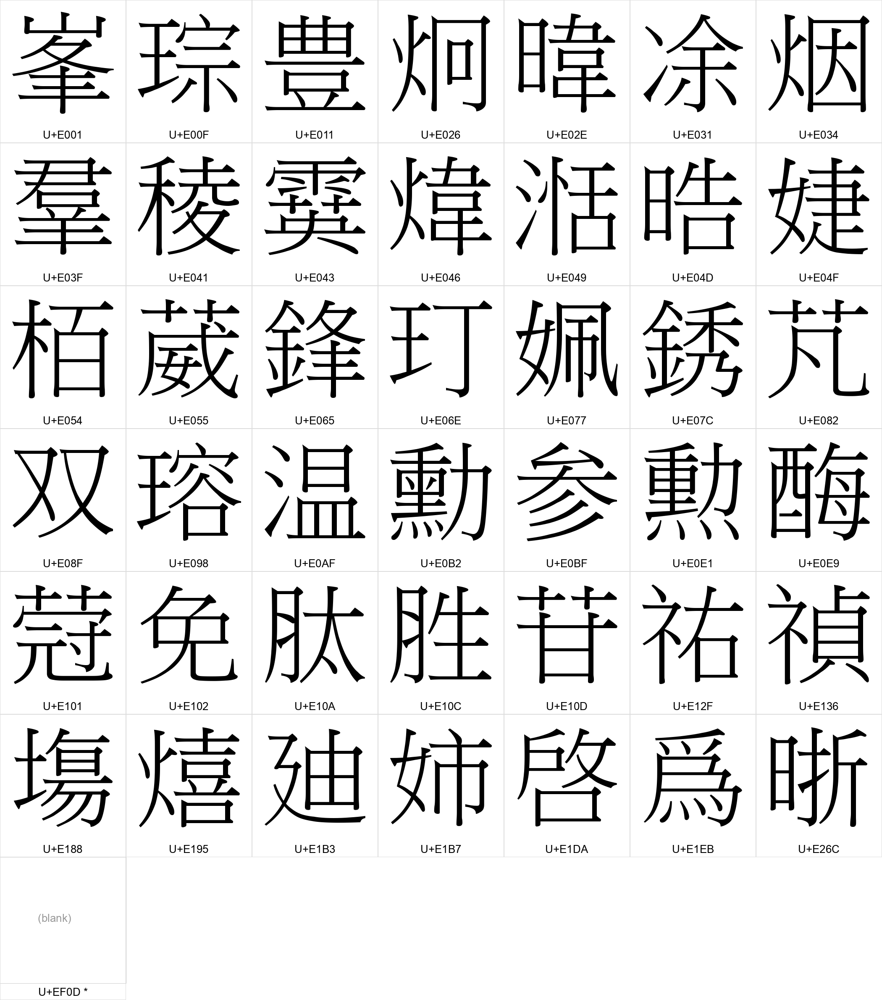

# PUA 造字字形考證（GServer 外字採收，2026-07-20）

> 逆向學校華康 GServer 外字服務，從學校自有造字檔 `MingGaiji.TTE` 撈出全部 **43 個**（2026-09 另補 2 個新出現碼位，共 **45**）
> PUA 造字碼位的字形並認字。**6 個既有對照（#44／#45 系網考證）與 GServer 字形完全吻合＝權威反證**。
> 本文為 `crawler/ntut_catalog/pua.py` 的 `PUA_MAP` 造字段依據。

## 1. 摘要

- **問題**：學校課程資料的教師名／課名／備註／課綱含私用區（PUA，主要 U+E0xx–U+E2xx）造字，一般瀏覽器無對應字型可畫（顯示為缺字方塊 ◻）。#44 建立分層正規化（canonical 忠實、v1 best-effort），#45 先補 5 個系網考證字。

- **字形來源＝權威**：學校自己的華康 GServer 外字服務（`font.ntut.edu.tw`）供應的 `MingGaiji.TTE`（學校造字檔）。直接取學校用來畫這些字的原始字型輪廓來認字，不再靠上下文猜測，並與既有系網考證交叉反證。

- **結果統計（43 碼位；2026-09 補 2 碼位 → 45）**：
  - **42 碼位已認字**（含 6 個既有對照；其中 `E031`／`E10D`／`E0E1` 由使用者覆核修正／補上，見 §4.1、§5）；
  - **1 碼位無字形**：`U+EF0D`（cmap 有碼位但 glyf 無輪廓，非實際造字，見 §4.2）。

- **入庫**：`PUA_MAP` 造字段現共 **42 碼位**；其中 `E031`／`E10D`／`E0E1` 三筆由使用者考證修正／補上（見 §4.1、§5）。`EF0D`（無字形、證據未定）不入表，維持「未收錄一律原樣保留（不猜、不刪）」原則。

- **2026-09 續作（§6）**：清空 `pua_scan` 累積的 **51 個待辦碼位**——23 個學校造字（有 GServer 輪廓）
  與 22 個 Wingdings 符號入表，6 個字型子集殘留不入表。`PUA_MAP` 現共 **98 碼位**
  （學校造字 67／Word 符號 31）。掃描恢復「有命中＝真的有待辦」。



## 2. GServer 外字服務協定（供未來新造字半自動考證）

學校用「華康 GServer 動態外字」在網頁畫這些造字。流程可程式化重現（**唯讀、務必節流 ≥0.6s/req、帶 Referer**）：

1. **域名**：`https://font.ntut.edu.tw/gws`。
2. **查詢（socket）**：GET 一個 socket 端點，字元以 UTF-8 百分比編碼帶在 `wd`（前導一個空格 `%20`，故產出的字型檔恰含「拉丁基本 + 這一個 PUA 字」）：

   ```
   /gws/socket/wfc_socket.aspx?queryType=query&tf=MingGaiji.TTE
     &wd=%20<URL編碼字>&fn=<rand>_ff.png&ff=MingLiu
     &pnglocation=/gws/outline/wfc/<rand>_ff.png
     &isUTF8=true&theProtocol=https&useBrowser=tt&PEncode=UTF-8
   ```

   `fn`（檔名）**由 client 隨機自選**（`<1..735723>_ff.png`）；socket 呼叫是「副作用」——伺服器據此在 `pnglocation` 生成該字型檔。回應是一段 JS（`parent.cssPath='https://.../fontcss/<fn>.css';…`），指向動態產生的 CSS。
3. **取字型檔**：GET `/gws/outline/wfc/<fn>`。**副檔名雖是 `.png`，內容其實是 TTF**（magic `00 01 00 00`，Content-Type 謊報 `image/png`）——瀏覽器 `@font-face` 靠內容 sniff 吃它，直接當圖片開會被圖片解碼器拒絕。
4. **認字**：`fontTools` 讀 cmap 確認碼位有 glyph、`glyf` 輪廓非空；`freetype` 算圖比對真字（本次 256px 算圖、置中貼 300×300、反白為黑字白底）。

**禮貌使用**：唯讀查學校自有字型；本次採收每 request 間隔 0.6s、單一 UA＋Referer，一次把 43 碼位撈完即止。工具腳本見素材 `gserver-glyphs/harvest.py`。

## 3. 認字結果總表（43 碼位）

認定字的 `U+` 一律以 Python `ord()` 計算（避免手抄異體字錯碼，如 峯 U+5CEF≠峰 U+5CF0、羣≠群、塲≠場、姉≠姊、啓≠啟、爲≠為）。出處 URL 可直接點開學校課程系統核對。雙造字姓名（溫紹羣、吳姉霙）的 ◻ 無法自動辨位，依字形位置手動覆核。

| 碼位 | 認定字 (U+) | 信心 | 出處樣本（學校頁可點） | 狀態 |
|---|---|---|---|---|
| `U+E001` | 峯 (U+5CEF) | high | 教師 [楊明峯](https://aps.ntut.edu.tw/course/tw/Teach.jsp?format=-3&year=115&sem=1&code=21963)（115-1）；課綱課號 [362760](https://aps.ntut.edu.tw/course/tw/ShowSyllabus.jsp?snum=362760&code=12302)：…化學，曾文峯、許君漢、曹文正編… | 本 PR 新增 PUA_MAP |
| `U+E00F` | 琮 (U+742E) | high | 教師 [黃琮昇](https://aps.ntut.edu.tw/course/tw/Teach.jsp?format=-3&year=115&sem=1&code=12338)（115-1）；課綱課號 [362229](https://aps.ntut.edu.tw/course/tw/ShowSyllabus.jsp?snum=362229&code=12338)：…黃琮昇… | 已入 PUA_MAP（#44/#45） |
| `U+E011` | 豐 (U+8C50) | high | 課綱課號 [366889](https://aps.ntut.edu.tw/course/tw/ShowSyllabus.jsp?snum=366889&code=22314)：…亞洲現代美術館、日本豐島美術館… | 本 PR 新增 PUA_MAP |
| `U+E026` | 炯 (U+70AF) | high | 教師 [陳炯曉](https://aps.ntut.edu.tw/course/tw/Teach.jsp?format=-3&year=114&sem=2&code=22027)（114-2） | 本 PR 新增 PUA_MAP |
| `U+E02E` | 暐 (U+6690) | high | 課綱課號 [366510](https://aps.ntut.edu.tw/course/tw/ShowSyllabus.jsp?snum=366510&code=11172)：…功能介紹 譯者： 蘇暐婷 出版社：旗標…；課綱課號 [366517](https://aps.ntut.edu.tw/course/tw/ShowSyllabus.jsp?snum=366517&code=11172)：…功能介紹 譯者： 蘇暐婷 出版社：旗標… | 本 PR 新增 PUA_MAP |
| `U+E031` | 凃 (U+51C3) | 使用者考證 | 課綱課號 [366510](https://aps.ntut.edu.tw/course/tw/ShowSyllabus.jsp?snum=366510&code=11172)：…作者： 凃俐雯 追蹤作者…（教材作者；字形左旁為冫兩點水，非氵；採收誤認為涂） | 本 PR 新增 PUA_MAP |
| `U+E034` | 烟 (U+70DF) | high | 課綱課號 [366571](https://aps.ntut.edu.tw/course/tw/ShowSyllabus.jsp?snum=366571&code=24544)：…/ 傳） 2. 《雲烟過眼錄》（宋 周密… | 本 PR 新增 PUA_MAP |
| `U+E03F` | 羣 (U+7FA3) | high | 教師 [溫紹羣](https://aps.ntut.edu.tw/course/tw/Teach.jsp?format=-3&year=115&sem=1&code=24600)（115-1）；備註課號 [338762](https://aps.ntut.edu.tw/course/tw/Curr.jsp?format=-2&code=338762)：…理，台北上課( 溫紹羣)… | 本 PR 新增 PUA_MAP |
| `U+E041` | 稜 (U+7A1C) | high | 課綱課號 [362994](https://aps.ntut.edu.tw/course/tw/ShowSyllabus.jsp?snum=362994&code=12350)：…重閱讀，猶如光線照進稜鏡——閱讀〈物哀〉…；課綱課號 [363135](https://aps.ntut.edu.tw/course/tw/ShowSyllabus.jsp?snum=363135&code=12350)：…重閱讀，猶如光線照進稜鏡——閱讀〈物哀〉… | 本 PR 新增 PUA_MAP |
| `U+E043` | 霙 (U+9719) | high | 教師 [吳姉霙](https://aps.ntut.edu.tw/course/tw/Teach.jsp?format=-3&year=115&sem=1&code=24191)（115-1） | 本 PR 新增 PUA_MAP |
| `U+E046` | 煒 (U+7152) | high | 教師 [徐昕煒](https://aps.ntut.edu.tw/course/tw/Teach.jsp?format=-3&year=115&sem=1&code=12436)（115-1）；教師 [林明煒](https://aps.ntut.edu.tw/course/tw/Teach.jsp?format=-3&year=115&sem=1&code=24556)（115-1） | 已入 PUA_MAP（#44/#45） |
| `U+E049` | 湉 (U+6E49) | high | 課綱課號 [366781](https://aps.ntut.edu.tw/course/tw/ShowSyllabus.jsp?snum=366781&code=23670)：…Co.（著）、謝永湉（譯），《一九五八…；課綱課號 [366844](https://aps.ntut.edu.tw/course/tw/ShowSyllabus.jsp?snum=366844&code=23670)：…Co.（著）、謝永湉（譯），《一九五八… | 本 PR 新增 PUA_MAP |
| `U+E04D` | 晧 (U+6667) | high | 教師 [林晢晧](https://aps.ntut.edu.tw/course/tw/Teach.jsp?format=-3&year=112&sem=2&code=24507)（112-2） | 本 PR 新增 PUA_MAP |
| `U+E04F` | 婕 (U+5A55) | high | 課綱課號 [366876](https://aps.ntut.edu.tw/course/tw/ShowSyllabus.jsp?snum=366876&code=22640)：…劉昉青 祁業榮 郭婕 (2007)。運… | 本 PR 新增 PUA_MAP |
| `U+E053` | 珺 (U+73FA) | high | 課綱課號 [366826](https://aps.ntut.edu.tw/course/tw/ShowSyllabus.jsp?snum=366826&code=23919)：…Cultural Studies. 2nd ed.)（楊祖珺譯），台北：遠流。… | 2026-09-01 新增（外部佐證：遠流 1997《傳播及文化研究主要概念》譯者楊祖珺） |
| `U+E054` | 栢 (U+6822) | high | 備註課號 [325372](https://aps.ntut.edu.tw/course/tw/Curr.jsp?format=-2&code=325372)：…教師李栢浡,CLS410教…；備註課號 [318094](https://aps.ntut.edu.tw/course/tw/Curr.jsp?format=-2&code=318094)：…教師李栢浡,CLS410教… | 本 PR 新增 PUA_MAP |
| `U+E055` | 葳 (U+8473) | high | 課綱課號 [361268](https://aps.ntut.edu.tw/course/tw/ShowSyllabus.jsp?snum=361268&code=12200)：…，有任何問題可與吳南葳老師(nwwu@n…；課綱課號 [362492](https://aps.ntut.edu.tw/course/tw/ShowSyllabus.jsp?snum=362492&code=12200)：…，有任何問題可與吳南葳老師(nwwu@n… | 本 PR 新增 PUA_MAP |
| `U+E058` | 媜 (U+5A9C) | high | 課綱課號 [360744](https://aps.ntut.edu.tw/course/tw/ShowSyllabus.jsp?snum=360744&code=23602)：…伊莉莎白《當綠葉緩緩落下》 簡媜《誰在銀閃閃的地方 等你》… | 2026-09-01 新增（外部佐證：印刻《誰在銀閃閃的地方，等你》作者簡媜；字形右旁 貞(⺊+貝) 非 真） |
| `U+E065` | 鋒 (U+92D2) | high | 課綱課號 [361491](https://aps.ntut.edu.tw/course/tw/ShowSyllabus.jsp?snum=361491&code=12036)：…之超快雷射鑽孔 曾釋鋒 教授 第2週 P…；課綱課號 [362821](https://aps.ntut.edu.tw/course/tw/ShowSyllabus.jsp?snum=362821&code=11493)：…計（第二版）, 劉邦鋒 著, 國立臺灣大… | 本 PR 新增 PUA_MAP |
| `U+E06E` | 玎 (U+738E) | high | 課綱課號 [364509](https://aps.ntut.edu.tw/course/tw/ShowSyllabus.jsp?snum=364509&code=12037)：…裕, 張宇欣, 廖凰玎，2015 ，臺灣… | 本 PR 新增 PUA_MAP |
| `U+E077` | 姵 (U+59F5) | high | 備註課號 [325274](https://aps.ntut.edu.tw/course/tw/Curr.jsp?format=-2&code=325274)：…教師黃文曄、丁姵如,法2F03教室…；備註課號 [325284](https://aps.ntut.edu.tw/course/tw/Curr.jsp?format=-2&code=325284)：…教師丁姵如,商5F01教室… | 本 PR 新增 PUA_MAP |
| `U+E07C` | 銹 (U+92B9) | high | 課綱課號 [361713](https://aps.ntut.edu.tw/course/tw/ShowSyllabus.jsp?snum=361713&code=10506)：…質變化實驗。 2.不銹鋼料（18-8不銹…；課綱課號 [364411](https://aps.ntut.edu.tw/course/tw/ShowSyllabus.jsp?snum=364411&code=11364)：…第七週 構造用鋼及不銹鋼之種類、特性及選… | 本 PR 新增 PUA_MAP |
| `U+E082` | 芃 (U+8283) | high | 備註課號 [325285](https://aps.ntut.edu.tw/course/tw/Curr.jsp?format=-2&code=325285)：…教師蘇芃竹,社205教室,…；備註課號 [325288](https://aps.ntut.edu.tw/course/tw/Curr.jsp?format=-2&code=325288)：…教師蘇芃竹,社205教室,… | 本 PR 新增 PUA_MAP |
| `U+E08F` | 双 (U+53CC) | high | 課綱課號 [366823](https://aps.ntut.edu.tw/course/tw/ShowSyllabus.jsp?snum=366823&code=24411)：…000）。 2. 楊双子，《綺譚花物語》… | 本 PR 新增 PUA_MAP |
| `U+E098` | 瑢 (U+7462) | high | 課綱課號 [366810](https://aps.ntut.edu.tw/course/tw/ShowSyllabus.jsp?snum=366810&code=12379)：…r 譯者： 余芊瑢, 朱惠瓊 出版社…；課綱課號 [366910](https://aps.ntut.edu.tw/course/tw/ShowSyllabus.jsp?snum=366910&code=12379)：…r 譯者： 余芊瑢, 朱惠瓊 出版社… | 本 PR 新增 PUA_MAP |
| `U+E0AF` | 溫 (U+6EAB) | high | 教師 [溫紹羣](https://aps.ntut.edu.tw/course/tw/Teach.jsp?format=-3&year=115&sem=1&code=24600)（115-1）；備註課號 [353176](https://aps.ntut.edu.tw/course/tw/Curr.jsp?format=-2&code=353176)：…陽明交大溫宏斌https:/… | 本 PR 新增 PUA_MAP |
| `U+E0B2` | 勳 (U+52F3) | high | 教師 [吳建勳](https://aps.ntut.edu.tw/course/tw/Teach.jsp?format=-3&year=115&sem=1&code=12285)（115-1）；教師 [陳佳勳](https://aps.ntut.edu.tw/course/tw/Teach.jsp?format=-3&year=115&sem=1&code=12630)（115-1） | 已入 PUA_MAP（#44/#45） |
| `U+E0BF` | 參 (U+53C3) | high | 課綱課號 [362429](https://aps.ntut.edu.tw/course/tw/ShowSyllabus.jsp?snum=362429&code=23467)：…討論、上課狀況、上課參與、作業等):40…；課綱課號 [366271](https://aps.ntut.edu.tw/course/tw/ShowSyllabus.jsp?snum=366271&code=11014)：…：日本紀伊山地?場?參詣道、絲綢之路… | 本 PR 新增 PUA_MAP |
| `U+E0E1` | 勳 (U+52F3) | 使用者考證 | 教師 [王柏勳](https://aps.ntut.edu.tw/course/tw/Teach.jsp?format=-3&year=113&sem=1&code=24593)（113-1；經教師本人社群帳號確認） | 本 PR 新增 PUA_MAP（與 E0B2 同字異碼） |
| `U+E0E9` | 酶 (U+9176) | high | 課綱課號 [362852](https://aps.ntut.edu.tw/course/tw/ShowSyllabus.jsp?snum=362852&code=12678)：…序列稀釋，DNA複製酶連鎖反應，質體分離…；課程說明課號 [362852](https://aps.ntut.edu.tw/course/tw/Curr.jsp?format=-2&code=362852)：…序列稀釋，DNA複製酶連鎖反應，質體分離… | 本 PR 新增 PUA_MAP |
| `U+E101` | 蔻 (U+853B) | high | 教師 [賴峓蔻](https://aps.ntut.edu.tw/course/tw/Teach.jsp?format=-3&year=115&sem=1&code=24232)（115-1）；課綱課號 [366483](https://aps.ntut.edu.tw/course/tw/ShowSyllabus.jsp?snum=366483&code=24232)：…賴峓蔻… | 本 PR 新增 PUA_MAP |
| `U+E102` | 免 (U+514D) | high | 課綱課號 [360924](https://aps.ntut.edu.tw/course/tw/ShowSyllabus.jsp?snum=360924&code=22898)：…勃發展，為癌症、自體免疫疾病等難治疾病的…；課綱課號 [360955](https://aps.ntut.edu.tw/course/tw/ShowSyllabus.jsp?snum=360955&code=10894)：…活性物質（如抗生素、免疫體、酵素、毒素、… | 本 PR 新增 PUA_MAP |
| `U+E10A` | 肽 (U+80BD) | high | 課綱課號 [362380](https://aps.ntut.edu.tw/course/tw/ShowSyllabus.jsp?snum=362380&code=11108)：…in （氨基酸、肽鍵、蛋白質） Ch… | 本 PR 新增 PUA_MAP |
| `U+E10C` | 胜 (U+80DC) | high | 課綱課號 [362380](https://aps.ntut.edu.tw/course/tw/ShowSyllabus.jsp?snum=362380&code=11108)：…ein （氨基酸、胜鍵、蛋白質） C… | 本 PR 新增 PUA_MAP |
| `U+E10D` | 苷 (U+82F7) | 使用者考證 | 課綱課號 [362380](https://aps.ntut.edu.tw/course/tw/ShowSyllabus.jsp?snum=362380&code=11108)：…acids (核苷酸與核酸）…（上下文核苷酸；字形艹+甘；採收誤認為昔） | 本 PR 新增 PUA_MAP |
| `U+E12F` | 祐 (U+7950) | high | 課綱課號 [366781](https://aps.ntut.edu.tw/course/tw/ShowSyllabus.jsp?snum=366781&code=23670)：…09年。 33. 姚祐霆（執行編輯），《…；課綱課號 [366844](https://aps.ntut.edu.tw/course/tw/ShowSyllabus.jsp?snum=366844&code=23670)：…09年。 33. 姚祐霆（執行編輯），《… | 本 PR 新增 PUA_MAP |
| `U+E136` | 禎 (U+798E) | high | 教師 [胡貝禎](https://aps.ntut.edu.tw/course/tw/Teach.jsp?format=-3&year=115&sem=1&code=12600)（115-1）；教師 [洪禎祥](https://aps.ntut.edu.tw/course/tw/Teach.jsp?format=-3&year=115&sem=1&code=23969)（115-1） | 已入 PUA_MAP（#44/#45） |
| `U+E188` | 塲 (U+5872) | high | 課綱課號 [362977](https://aps.ntut.edu.tw/course/tw/ShowSyllabus.jsp?snum=362977&code=11066)：…數據處理的能力，4.塲發同學自行設計解決…；課綱課號 [363052](https://aps.ntut.edu.tw/course/tw/ShowSyllabus.jsp?snum=363052&code=22127)：…,如何配合造型設計及塲發造形創意,使學生… | 本 PR 新增 PUA_MAP |
| `U+E195` | 熺 (U+71BA) | high | 教師 [蘇春熺](https://aps.ntut.edu.tw/course/tw/Teach.jsp?format=-3&year=114&sem=1&code=11129)（114-1） | 已入 PUA_MAP（#44/#45） |
| `U+E1B3` | 廸 (U+5EF8) | high | 教師 [林廸](https://aps.ntut.edu.tw/course/tw/Teach.jsp?format=-3&year=115&sem=1&code=23533)（115-1）；課綱課號 [364676](https://aps.ntut.edu.tw/course/tw/ShowSyllabus.jsp?snum=364676&code=23533)：…林廸… | 已入 PUA_MAP（#44/#45） |
| `U+E1B7` | 姉 (U+59C9) | high | 教師 [吳姉霙](https://aps.ntut.edu.tw/course/tw/Teach.jsp?format=-3&year=115&sem=1&code=24191)（115-1） | 本 PR 新增 PUA_MAP |
| `U+E1DA` | 啓 (U+5553) | high | 課綱課號 [361268](https://aps.ntut.edu.tw/course/tw/ShowSyllabus.jsp?snum=361268&code=12531)：…美國都市街道生活的啓發. Transl…；課綱課號 [366806](https://aps.ntut.edu.tw/course/tw/ShowSyllabus.jsp?snum=366806&code=22487)：…哲學」對應指標「2.啓發思辨」有關。若採… | 本 PR 新增 PUA_MAP |
| `U+E1EB` | 爲 (U+7232) | high | 課綱課號 [362202](https://aps.ntut.edu.tw/course/tw/ShowSyllabus.jsp?snum=362202&code=11388)：…2週進行，1-16週爲課堂實體上課，17… | 本 PR 新增 PUA_MAP |
| `U+E26C` | 晣 (U+6663) | 使用者考證 | 教師 [羅睿晣](https://aps.ntut.edu.tw/course/tw/Teach.jsp?format=-3&year=115&sem=1&code=24626)（115-1）；政大師資頁 [羅睿晣](https://chinese.nccu.edu.tw/PageStaffing/Detail?fid=6122&id=4947)（同一國文兼任）；字形右旁折(扌+斤)非晰的木旁 | 本 PR 新增 PUA_MAP |
| `U+EF0D` | （無字形） | — | 課程說明課號 [363795](https://aps.ntut.edu.tw/course/tw/Curr.jsp?format=-2&code=363795)：…象及其應用。內容包括◻輔G熱力學?高分子…；課程說明課號 [365315](https://aps.ntut.edu.tw/course/tw/Curr.jsp?format=-2&code=365315)：…象及其應用。內容包括◻輔G熱力學?高分子… | **不入表**（無輪廓，見 §4.2） |

## 4. 需人工確認／特例（不入 `PUA_MAP`）

### 4.1 `U+E0E1` — 勳（已由使用者考證確認，2026-07-20）

GServer 字形上部與 `U+E0B2`（勳）同族但略異，字形上**最像 勲**（U+52F2，日式異體、下部四點）。但**使用者經教師本人 Instagram 帳號確認為 勳**（U+52F3，與 `U+E0B2` 同字，屬造字重複建檔的**同字異碼**），已定案入 `PUA_MAP`。出處：教師 王柏勳（管院《自媒體行銷學》，[https://aps.ntut.edu.tw/course/tw/Teach.jsp?format=-3&year=113&sem=1&code=24593](https://aps.ntut.edu.tw/course/tw/Teach.jsp?format=-3&year=113&sem=1&code=24593)）。此例即「字形目視 ≠ 真字」的典型（見 §5 教訓）。


### 4.2 `U+EF0D` — 無字形（不處理）

`MingGaiji.TTE` cmap 雖有此碼位，但 `glyf` 無輪廓（回空字形），研判非學校實際造字。出現在課程說明，例：課號 [363795](https://aps.ntut.edu.tw/course/tw/Curr.jsp?format=-2&code=363795)「…象及其應用。內容包括◻輔G熱力學?高分子…」。**留原樣、不入 `PUA_MAP`**；該課程簡介文字本身多重壞損（含裸 `?` 等），無可靠語境可考。（曾一度被當作 E26C「晣」的候選來源，已釐清該證據屬 `U+E26C`；`EF0D` 本身仍無字形。）

## 5. 可信度與方法

- **權威反證**：6 個既有系網考證（E00F 琮、E046 煒、E0B2 勳、E136 禎、E195 熺、E1B3 廸）與 GServer 撈出的字形逐一吻合，交叉驗證認字管線可靠。

- **異體字忠實**：認定字保留來源字形的異體（峯／羣／双／塲／姉／啓／爲／溫 等），`U+` 以 `ord()` 計算入庫，不正規化為通用體。

- **教訓：近似字（凃／涂、苷／昔、晣／晰）僅靠字形目視會誤判**——GServer 字形是強線索但非終審。`E031`（凃 vs 涂：左旁 冫/氵）、`E10D`（苷 vs 昔：艹+甘 vs 昔）、`E26C`（晣 vs 晰：右旁 折(扌+斤)/析(木+斤)）三筆採收初判皆有誤，經使用者以**上下文與外部佐證**（教材作者「凃俐雯」、生化術語「核苷酸」、政大師資頁「羅睿晣」）覆核修正。另 `E0E1` 字形最像日式異體 勲，亦經教師本人社群帳號確認實為 勳（見 §4.1）。**上下文與外部佐證優先於字形辨識**。

- **分層不變**：造字只在 v1 消費層由 `PUA_MAP` 正規化，canonical 忠實保留來源原文；合併後每日 cron 重建 v1 時自動生效於全歷史學期，不需重爬。

- **素材存檔**（本次考證，未入 repo）：`gserver-glyphs/harvest_results.json`（43 碼位採收明細）、`pua-evidence.json`（各碼位原始出處與 URL）、逐字 `glyph_<CP>.png`。

## 6. 2026-09 批次：清空 51 個待辦碼位

`pua_scan` 長期累積 51 個未收錄碼位，噪音蓋過真正的新造字（使用者原話：「這些 PUA Code 會在
PUA Scan 時 Error，我無法直接判斷是否有新值」）。本批一次向 GServer 要回全部 51 字（單一 socket
呼叫、`688687_ff.png.ttf` 43,336 bytes），結果乾淨地分成三組：

| 組別 | 數量 | GServer 字形 | 處置 |
|---|---|---|---|
| 學校造字 `E000–E2FF` | 23 | **有輪廓** | 使用者逐碼目視判讀 → 入 `PUA_MAP` |
| Word/Wingdings `F020–F0FF` | 22 | 無 | 依 Wingdings 字形名對應 → 入 `PUA_MAP` |
| 字型子集殘留 | 6 | 無 | 不對應（見 §6.3） |

**「有無輪廓」就是判別依據**：23 個有輪廓的全部落在 `E005–E202`，28 個沒輪廓的全部落在該區之外。
GServer 供應的是學校自有造字檔，它畫不出來的碼位，本質上就不是學校造字。

### 6.1 學校造字 23 碼

| `U+E005` | 綉 (U+7D89) | 5 | [電腦輔助製造](https://aps.ntut.edu.tw/course/tw/ShowSyllabus.jsp?snum=296907&code=24253)：…門 作者： 邱聰倚, 姚家琦, 吳◻華, 黃婷琪, 周芳吟 新功… | 字形認定 |
| `U+E010` | 堃 (U+5803) | 4 | [教師專業發展](https://aps.ntut.edu.tw/course/tw/ShowSyllabus.jsp?snum=298148&code=11040)：…題。臺北:五南 12.陳伯璋、張盈◻編。學校教師的生活世界。臺北:心… | 字形認定 |
| `U+E016` | 敘 (U+6558) | 1 | [金融數據分析邏輯思維](https://aps.ntut.edu.tw/course/tw/ShowSyllabus.jsp?snum=352282&code=11505)：…:數據敘事的視角 - 資料類型與◻述統計 - EDA的重要 - 描… | 字形為 敍，依使用者判讀正規化 |
| `U+E017` | 況 (U+6CC1) | 3 | [海洋環保概論](https://aps.ntut.edu.tw/course/tw/ShowSyllabus.jsp?snum=294704&code=23202)：…du.tw  台灣海洋保護區的現◻與挑戰，邵廣昭、賴昆祺；中央研究… | 字形為 况，依使用者判讀正規化 |
| `U+E03C` | 烜 (U+70DC) | 7 | [太空科技應用](https://aps.ntut.edu.tw/course/tw/ShowSyllabus.jsp?snum=291873&code=12303)：…人類太空與行星科學 (講師：葉永◻ (中央研究院 院士/中央大學教… | 字形認定 |
| `U+E05F` | 瀞 (U+701E) | 6 | [領導概論](https://aps.ntut.edu.tw/course/tw/ShowSyllabus.jsp?snum=299543&code=11314)：…力.影響力.即興力.連結力﹥ 洪◻，自己的力學:找到喜歡又做得好的… | 字形認定 |
| `U+E062` | 献 (U+732E) | 2 | [工廠管理](https://aps.ntut.edu.tw/course/tw/ShowSyllabus.jsp?snum=300624&code=11435)：…王◻彰. (2020), 工廠管理,… | 字形認定 |
| `U+E081` | 庄 (U+5E84) | 4 | [文化專題（一）](https://aps.ntut.edu.tw/course/tw/ShowSyllabus.jsp?snum=305544&code=11147)：…生活與變遷：《頂下郊拚》<一、八甲◻的英雄們>、<八、三郊總長> 七… | 字形認定 |
| `U+E0CD` | 坂 (U+5742) | 4 | [物聯網應用概論](https://aps.ntut.edu.tw/course/tw/ShowSyllabus.jsp?snum=324368&code=12398)：…解IoT｜物聯網的開發技術與原理，◻東大輔，碁峰 畫說 IoT 物聯… | 字形認定 |
| `U+E0E3` | 烱 (U+70F1) | 2 | [動力學](https://aps.ntut.edu.tw/course/tw/ShowSyllabus.jsp?snum=345060&code=23509)：…科書:應用力學-動力學 中譯本 溫◻亮等譯 高立圖書 授課教師:蕭… | 字形認定 |
| `U+E0EA` | 玨 (U+73A8) | 2 | [工程識圖實務](https://aps.ntut.edu.tw/course/tw/ShowSyllabus.jsp?snum=334506&code=23211)：…1. 王◻，【建築識圖應用「結構施工圖、建… | 字形認定 |
| `U+E0F1` | 槺 (U+69FA) | 7 | [工程數學(一)](https://aps.ntut.edu.tw/course/tw/ShowSyllabus.jsp?snum=289278&code=12202)：…Textbook: 黃孟◻譯:高等工程數學 華泰文化 原… | 字形認定 |
| `U+E0F3` | 聿 (U+807F) | 8 | [當前建築思潮](https://aps.ntut.edu.tw/course/tw/ShowSyllabus.jsp?snum=291627&code=21522)：…易斯·康篇（2堂） 【期中考】 貝◻銘篇（2堂） 第四單元 21世紀… | 字形認定 |
| `U+E11A` | 館 (U+9928) | 6 | [電子學](https://aps.ntut.edu.tw/course/tw/ShowSyllabus.jsp?snum=289288&code=11009)：…研究室分機2121,綜科◻317室。… | 字形認定 |
| `U+E122` | 憙 (U+6199) | 10 | [教育社會學](https://aps.ntut.edu.tw/course/tw/ShowSyllabus.jsp?snum=294671&code=11040)：…出版社。 2.現代教育社會學。陳奎◻主編，師大書苑 3.教育社會學。… | 字形認定 |
| `U+E15C` | 腳 (U+8173) | 3 | [職場英文溝通](https://aps.ntut.edu.tw/course/tw/ShowSyllabus.jsp?snum=324556&code=24517)：…職場價值與優勢，協助個人在職場不同◻色扮演中，培養受人信任，溝通無礙… | 字形為 脚，依使用者判讀正規化 |
| `U+E17A` | 个 (U+4E2A) | 8 | [本土語文(一)閩南語文](https://aps.ntut.edu.tw/course/tw/ShowSyllabus.jsp?snum=312954&code=11147)：…、由來與轉變 6 定定是十七歲的彼◻畫面 聽歌曲：故鄉(葉啟田)… | 字形認定 |
| `U+E19C` | 瑤 (U+7464) | 2 | [法律與生活](https://aps.ntut.edu.tw/course/tw/ShowSyllabus.jsp?snum=332231&code=11314)：…，大塊文化出版股份有限公司。 陳柏◻/譯，村田智明/著，讓動作不NG… | 字形認定 |
| `U+E19E` | 庙 (U+5E99) | 5 | [中國建築史](https://aps.ntut.edu.tw/course/tw/ShowSyllabus.jsp?snum=327347&code=11014)：…，線上課程學習。教學影片：婆浮屠寺◻群https://www.you… | 字形認定 |
| `U+E1D1` | 棊 (U+68CA) | 8 | [機械基礎實習(一)](https://aps.ntut.edu.tw/course/tw/ShowSyllabus.jsp?snum=307527&code=24465)：…礎實習 作者：廖倉祥 陳奇明 王繹◻ 出版商：台科大圖書 4.自編教… | 字形認定 |
| `U+E1EC` | 腈 (U+8148) | 4 | [高分子化學實驗](https://aps.ntut.edu.tw/course/tw/ShowSyllabus.jsp?snum=291499&code=10914)：…,嫘縈,醋酸纖維;聚酯纖維,聚丙烯◻纖維,聚乙烯纖維,聚丙烯纖維,聚… | 字形認定 |
| `U+E1F4` | 暳 (U+66B3) | 2 | [國際科技談判](https://aps.ntut.edu.tw/course/tw/ShowSyllabus.jsp?snum=357737&code=11610)：…】國際科技談判案例介紹 講師：蔡馨◻ 第3週 9/30 【國際科技談… | 字形認定 |
| `U+E202` | 強 (U+5F37) | 4 | [職場英文溝通](https://aps.ntut.edu.tw/course/tw/ShowSyllabus.jsp?snum=324556&code=24517)：…通過“職場英文溝通”這門課，◻化英文單字能力，熟記字彙片語。除… | 字形認定 |

`E016`／`E017`／`E15C` 三筆的 GServer 字形是異體（敍／况／脚），使用者判讀時要求正規化為通用字
（敘／況／腳），理由是課綱語境一律為「敘述統計」「情況」「腳色扮演」。**這是本文件中首次刻意
不套用 §5「異體字忠實」原則的案例**——差別在於前面那些異體出現在**人名**（峯／羣／姉），改字等於
改人家的名字；這三個出現在**一般詞彙**，保留異體只會讓搜尋比對失效。日後審查請勿「修正」回異體。

### 6.2 Word/Wingdings 22 碼

不是猜的，有學校頁面實地佐證：`ShowSyllabus` 把這些字元寫成 HTML 數值參照。
[研究方法 (snum=298920)](https://aps.ntut.edu.tw/course/tw/ShowSyllabus.jsp?snum=298920&code=11403)
第 8 週原文為「圖書館資源分享：`&#61569;`圖書館學術資源…；`&#61570;`美加地區碩博士論文…」，
`&#61569;`=`U+F081`、`&#61570;`=`U+F082`，而 Wingdings 0x81/0x82 的 post 字形名正是
`onesans`/`twosans`（＝①②）；本批 `F081–F08A` 恰為連續十碼，與 Wingdings ①–⑩ 完全吻合。
字形一律取自系統 `Wingdings.ttf` 的 (3,0) cmap 實際輪廓。

處置分三種：**有語意的保留**（①–⑩、●○▪➔）、**佔位裝飾轉空格**（太陽/方框/裝飾引號，保住原有
縮排結構）、**純裝飾刪除**（放大鏡 `F024`、花飾 `F0B2`）。`F024` 出現在 `technology◻.` 這種句中
位置，轉空格會變成 `technology .` 反而更糟，故刪除。

`F026`（book，用作「章名↔參考文獻」分隔）保留語意，但 **Unicode 7.0 對 Wingdings 0x26 的官方
對應 `U+1F56E` 實測無字型覆蓋、畫出來仍是空白**——換一個同樣畫不出來的碼位等於沒修，故改用
覆蓋完整的 `U+1F4D6` 📖。選目標碼位時「常見字型必有」的原則（見檔頭）比「官方對應」優先。

### 6.3 字型子集殘留 6 碼（不入表）

`E922`／`E9AF`／`EEE8`／`EF0F`／`F81A`／`F845`。PDF/Word 內嵌子集字型會把任意字形塞進任意 PUA
槽位，所以同一區會同時出現拉丁字母、引號和漢字。決定性證據兩筆：

- `U+F845` 出現在 [臺灣海洋文化史](https://aps.ntut.edu.tw/course/tw/ShowSyllabus.jsp?snum=324633&code=24018) 的
  `Johan Nicolay T◻nnessen`——捕鯨史學者 **Tønnessen**（*The History of Modern Whaling* 作者），
  確定是 **ø** (U+00F8)。
- `U+F81A` 出現在 [產業分析](https://aps.ntut.edu.tw/course/tw/ShowSyllabus.jsp?snum=290122&code=22834) 的
  `故以◻課堂上公佈◻為主`——**成對出現的引號**。

一個拉丁字母與一組引號落在相鄰碼位，正是子集化的特徵。`F81A`/`F845` 併入 `_RESIDUE_RANGES`
（上界 `F7FF`→`F8FF`，BMP PUA 結尾）；E 區四碼改列 `KNOWN_EXCEPTIONS` 逐碼註明，**刻意不擴大成
整段區間**——真有新造字出現在 `E300` 以上時仍應報出來讓人看一眼。

`E9AF` 值得留一條線索：線上確認為 `&#59823;`，語境「讀書報告◻表20%」讀成「読書報告**発**表」
語意通順（発＝發的日文新字體）。但推導路徑不可靠（曾用 Big5 造字區位元組反推，同一方法在
`F845` 上得出「燃」而正解是 ø ＝該方法是巧合非機制），且 GServer 無字形佐證，故**不入表**。

### 6.4 走過的冤枉路（給未來 session）

一度以為 28 個無輪廓碼位是 CP950/Big5 使用者造字區的位元組，算出來 `F845 → Big5 C8BC → 燃`。
但 `F845` 由外部佐證確定是 ø ＝**假設被證偽**。整個 BMP PUA 都能映進那張 Big5 表，所以「算得出來」
本身不構成證據。真正解開這批的是**去抓學校原始 HTML**——一看到 `&#61548;` 這種數值參照，
Word/Wingdings 的來源就確定了。**遇到 PUA 先看上游 HTML 的原始位元組，不要從碼位算。**
